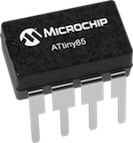
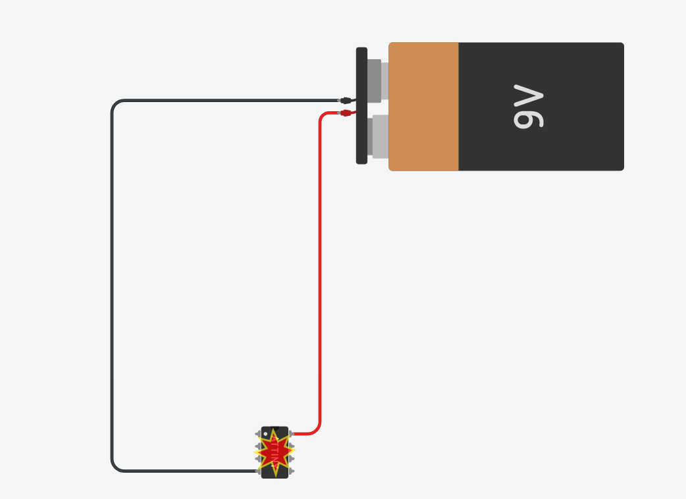
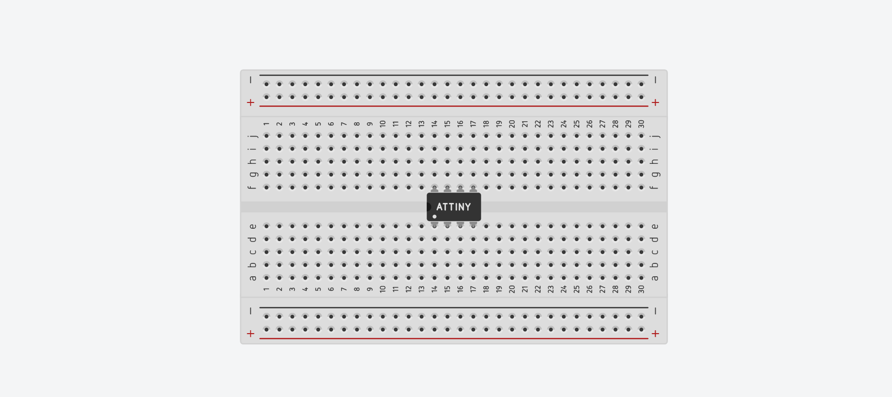
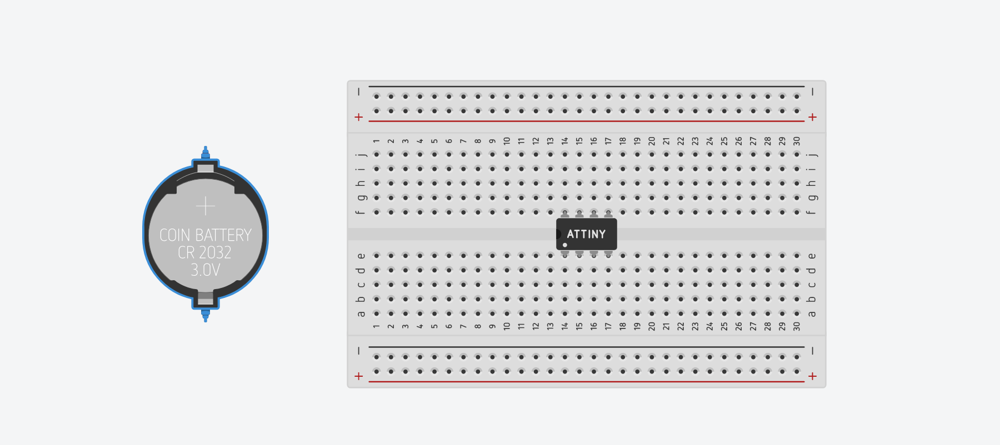
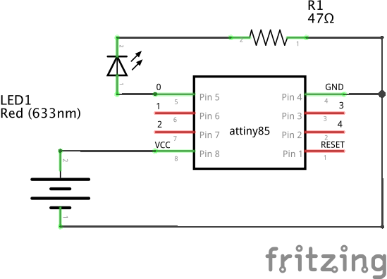
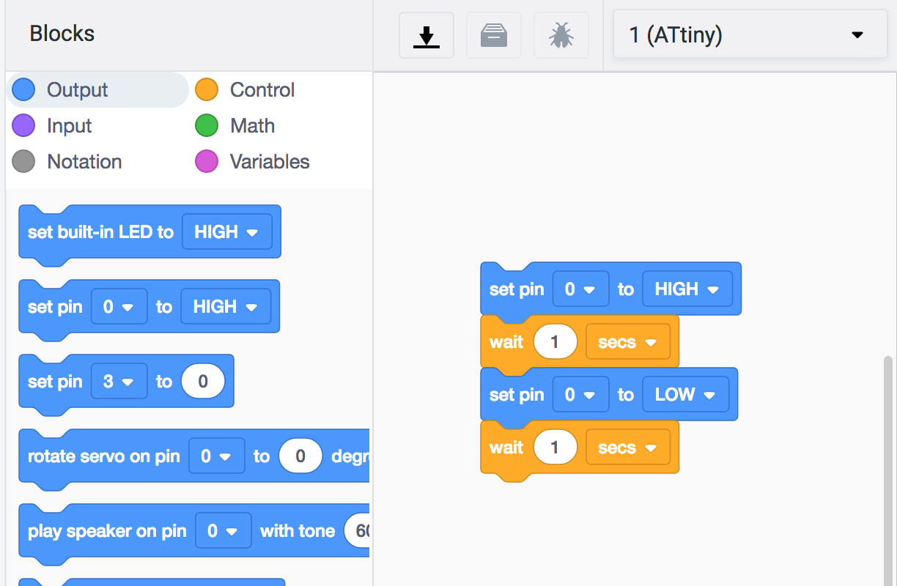
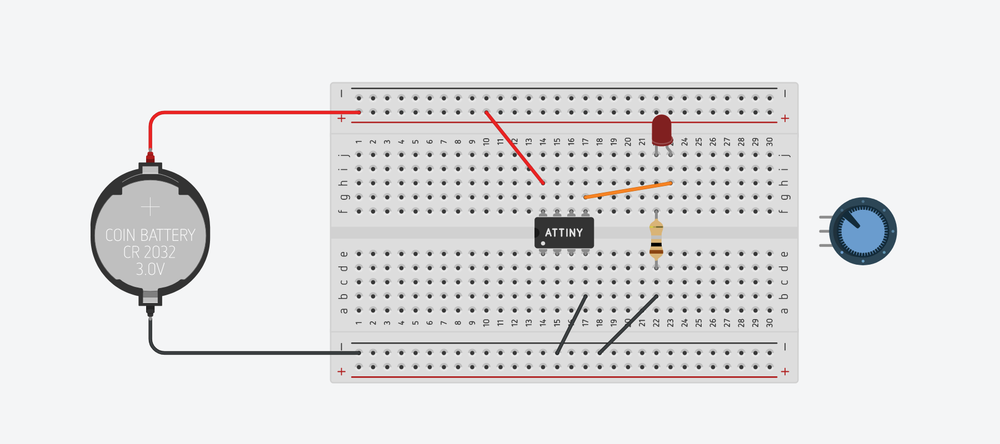
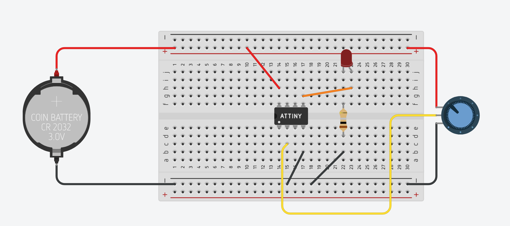
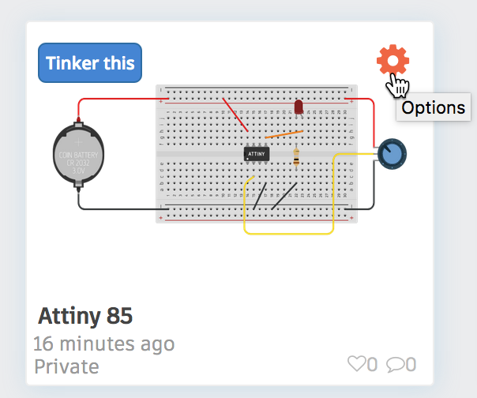
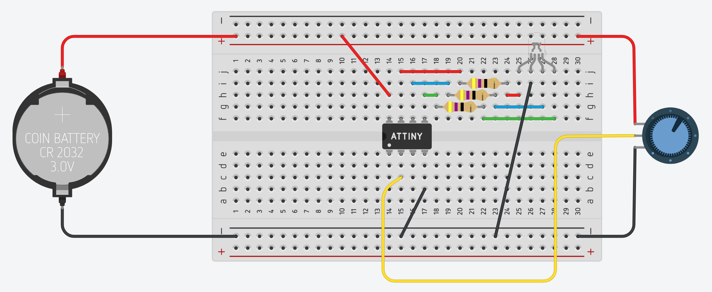

## About the ATtiny85 Microcontroller

The ATtiny85 microcontroller is a powerful yet extremely low cost (~ 50¢ each) [integrated circuit](https://learn.sparkfun.com/tutorials/integrated-circuits). The chip itself operates with an 8-bit data bus, which means it can access [8-bits](https://en.wikipedia.org/wiki/Octet_(computing)) of data per computer instruction (set, copy, add, subtract, multiply, compare, etc.).  Its CPU speed is capable of up to 8MHz and it has 8KB flash memory for storing Arduino programs.  [By comparison, our [Adafruit Feather M0](https://www.adafruit.com/product/3010) microcontrollers have a 32-bit data bus and operate at 48MHz with 256KB flash memory.  Much more powerful, but they cost 7 times as much!]

The ATtiny85 requires an operating voltage between 1.8V and 5.5V and has 5 I/O (input/output) pins for connecting electronic components.

Here is the pin breakout:   

Pin #8 (VCC) is connected to the positive terminal of your voltage source (1.8V - 5.5V).  Pin #4 (GND) is connected to ground / the negative terminal of your voltage source.  The [Arduino programming language](https://www.arduino.cc/reference/en/) can be used to control pins #5, #6, #7, #2 and #3:

* Pins 0 - 4 (marked in light blue) are all capable of digitalWrite()/digitalRead()
functions
* Pins 0 & 1 are capable of PWM analogWrite() at 8-bit resolution (0-255)
* Pins A1-A3 (marked in red) are capable of analogRead(), measuring analog voltage through a 10-bit ADC (Analog to Digital Converter).[^1]

[^1]: "10-bit" refers to the _resolution_ of the ADC, meaning that it can convert an analog signal into 1024 (0-1023) discrete levels.  See [https://en.wikipedia.org/wiki/Analog-to-digital_converter#Resolution](https://en.wikipedia.org/wiki/Analog-to-digital_converter#Resolution)

The RESET pin is a special pin; connecting this pin to GND will restart the program running on your ATtiny85.

---

## ATtiny85 Hands-On with Tinkercad

Over the course of this tutorial, we will create several circuits with the ATtiny85 microcontroller using Autodesk's Tinkercad circuit simulator:

* The classic project "Blinky"
* Programmatically Fade an LED
* Programmatically Fade an LED with a Potentiometer
* RGB LED color control with a Potentiometer

First, however, we need to wire up our ATtiny85 to a power supply.

---

### Powering an ATtiny85

!!! Warning
    As noted in the "About" section above, the ATtiny85 has an operating voltage between 1.8V and 5.5V.  Anything below 1.8V and the microcontroller will not have enough voltage to function.  Anything over 5.5V and you risk overloading the chip, as illustrated by the 9V battery blowing the IC in the image below:
    

For this tutorial, you can use 1.5V AA batteries -- you'll need more than one (2 batteries = 3V; 3 batteries = 4.5V) -- or a 3V coin cell battery.  The illustrations for the remainder of this tutorial will make use of a 3V coin cell battery.  

1.  Go to [tinkercad.com](https://tinkercad.com) and sign into your account.

1. Go to your Tinkercad Dashboard: [https://www.tinkercad.com/#/dashboard](https://www.tinkercad.com/#/dashboard)

1. Click on the [Circuits button](https://www.tinkercad.com/#/dashboard?type=circuits&collection=designs) in the left panel.

1. Click on the green "Create new Circuit" button.

    <button data-md-color-primary="green">Create new Circuit</button>

    A new blank canvas will open in your browser.

1. Place your ATtiny85 in the center of your breadboard, straddling the breadboard's ravine.

1. Place a battery near your breadboard.

1. Use a red wire to connect the positive (+) terminal of the battery to the + power bus of the breadboard.

1. Use a red wire to connect the + power bus of the breadboard to the VCC pin of the ATtiny85.

1. Use a black wire to connect the negative (-) terminal of the battery to the - power bus of the breadboard.

1. Use a black wired to connect the - power bus the breadboard to the GND pin of the ATtiny85.

---

### Project "Blinky"

First let's wire up the ATtiny85 for the classic Arduino project, Project Blinky. 

Here is a schematic:

For this project, you will need the following additional components:

- 1 x Red LED
- 1 x 47Ω Resistor

Drag the two components into your Tinkercad window and, consulting the circuit schematic above, recreate the circuit on your breadboard.

1.  Connect the anode (positive terminal) of the LED to digital pin 0 (light blue) of the ATtiny85 microcontroller.   

1.  Connect the cathode (negative terminal) of the LED to one end of the resistor.

1.  Connect the other end of the resistor to GND / the negative (-) power bus rail.

1.  Your final wiring should look like this:

Next we'll turn to the code necessary to turn the LED on and off programmatically.

1.  Click on the Code button in the upper-right of the interface.   

1. By default, Tinkercad will open into the Blocks code interface.  Blocks is a visual coding paradigm based on [MIT's Scratch](https://scratch.mit.edu/).  Note that Tinkercad has already pre-populated the Blocks code interface with blocks that set the ATtiny85's "built-in" LED to HIGH, wait one second, and then set the ATtiny85's "built-in" LED to LOW, waiting another second.   

    This may be confusing, since the ATtiny85 does NOT have a "built-in" LED like other Arduino microcontrollers such as the Arduino Uno do.  We _could_ replace the blocks that reference the built-in LED with the block that would "Set Pin 0 to HIGH/LOW".   

    

    However, we're going to switch over to the Text coding view instead.

1. Find the dropdown in the upper-left of the code panel and change it from "Blocks" to "Text".  You will be prompted to confirm this intention. Click "Continue."

1. You will note that Tinkercad has pre-populated the code interface with the following:   

        :::arduino
        void setup()
        {
            pinMode(0, OUTPUT);
        }

        void loop()
        {
           digitalWrite(0, HIGH);
            delay(1000); // Wait for 1000 millisecond(s)
            digitalWrite(0, LOW);
            delay(1000); // Wait for 1000 millisecond(s)
        }
    
    As it happens, this is just the code we need to turn pin 0 of the ATtiny85 on and off every second.

    In the [`setup()`](https://www.arduino.cc/reference/en/language/structure/sketch/setup/) function, the [`pinMode`](https://www.arduino.cc/reference/en/language/functions/digital-io/pinmode/) of pin 0 is set to `OUTPUT`.  And then in the [`loop()`](https://www.arduino.cc/reference/en/language/structure/sketch/loop/) function, the [`digitalWrite()`](https://www.arduino.cc/reference/en/language/functions/digital-io/digitalwrite/) function is called on pin 0 and set to HIGH.  A [`delay()`](https://www.arduino.cc/reference/en/language/functions/time/delay/) function of 1000 milliseconds is called.  And then a second `digitalWrite()` function sets pin 0 to LOW, followed by one more 1000 millisecond delay.

1.  Click "Start Simulation" and your LED should blink on and off.  

**Congratulations!** You've completed Project Blinky!

---

### Programmatically Fade an LED

We can use this same wiring scheme to _fade_ an LED instead of blinking it.  Instead of the `digitalWrite()` function, we'll instead use [`analogWrite()`](https://www.arduino.cc/reference/en/language/functions/analog-io/analogwrite/), taking advantage of the fact that Pin 0 is one of two pins on the ATtiny85 (marked in green below) that is capable of PWM (pulse width modulation).   

Let's modify the code accordingly:

1.  The `setup()` function can be left alone; we want digital pin 0 to function as an `OUTPUT`.

1.  The `loop()` function requires significant modification, so delete its contents entirely and we will work through the required logic line by line.

1.  Recall that PWM works by modifying the duty cycle of the pin.  Rather than being HIGH 100% of the time with a `digitalWrite(pin, HIGH)` function, or LOW 100% of the time with a `digitalWrite(pin, LOW)` function, the `analogWrite()` function enables us to set different percentages of HIGH/LOW to approximate an analog voltage signal at 256 levels between 0V (LOW) and 3V (HIGH).  So, `analogWrite(0, 127)` will cycle the LED HIGH 50% of the time and LOW 50% of the time and in the case of our 3V circuit, will approximate sending an analog voltage of 1.5V through the LED.   

    So, to fade our LED, we will want to iterate through increasing values between 0 and 255 to fade the LED to on, and then iterate through decreasing values from 255 to 0 to fade the LED off.  One way to write that code is line by line:

        :::arduino
        void loop(){
            analogWrite(0, 0);
            delay(30);
            analogWrite(0, 5);
            delay(30);
            analogWrite(0, 15);
            delay(30);
            analogWrite(0, 20);
            delay(30);
            analogWrite(0, 25);
            delay(30);
            analogWrite(0, 30);
            delay(30);
            ...  // continue increasing analogWrite by 5
            analogWrite(0, 250);
            delay(30);
            analogWrite(0, 255);
            delay(30);
            analogWrite(0, 250);
            delay(30);
            analogWrite(0, 245);
            delay(30);
            analogWrite(0, 240);
            delay(30);
            analogWrite(0, 235);
            delay(30);
            ... // continue decreasing analogWrite by 5
            analogWrite(0, 15);
            delay(30);
            analogWrite(0, 10);
            delay(30);
            analogWrite(0, 5);
        }
    
    But that is NOT very efficient! 

1.  Luckily, like many programming languages, Arduino has a [`for` control structure](https://www.arduino.cc/reference/en/language/structure/control-structure/for/) that will allow us to radically economize on the lines of code necessary to achieve the same result.   

    Here is the basic structure of a `for` loop:
        
        :::arduino
        for (initialization; condition; increment) {
	        //statement(s);
        }
    
    By convention, most programmers use the variable name `i` within a `for` loop.  For example:

        :::arduino
        for (int i = 0; i < 1000; i = i + 1)
        {
            // this code will run 1000 times!
        }

    But one can use any variable name:

        :::arduino
        for (int elephants = 0; elephants < 1000; elephants = elephants + 1)
        {
            // this code will also run 1000 times!
        }
    
    The incrementing code, `i = i + 1` is often abbreviated as `i++`:

        :::arduino
        for (int i = 0; i < 1000; i++)
        {
            // this code will run 1000 times, too!
        }
    
    Finally, incrementation is not limited to increments of 1:

        :::arduino
        // increments of 2
        for (int i = 0; i < 1000; i = i + 2)
        {
            // this code will run 500 times
        }

        // increments of 5, abbreviated notation
        for (int i = 0; i < 1000; i+=5) 
        {
            // this code will run 200 times!
        }
    
1. Whew!  That was quite a detour.  Let's get back to our LED fade `loop()` function.   

    We want our `analogWrite()` function to iterate up from 0 to 255 in increments of 5, so within our `loop()` function we can write:

        :::arduino
        void loop()
        {
            for (int lightLevel=0; lightLevel <= 255; lightLevel = lightLevel + 5)
            {
                analogWrite(0, lightLevel);
                delay(30);
            }
        }

    Click "Start Simulation" and you'll see that we're halfway there.  The LED starts OFF, fades to ON, and then jumps back to OFF again, fades to ON, jumps back to OFF, etc, etc.

1.  So we need a second `for` loop to decrement the light level (highlighted in yellow):

        :::arduino hl_lines="8 9 10 11 12"
        void loop()
        {
            for (int lightLevel=0; lightLevel <= 255; lightLevel = lightLevel + 5)
            {
                analogWrite(0, lightLevel);
                delay(30);
            }
            for (int lightLevel=255; lightLevel >= 0; lightLevel = lightLevel - 5)
            {
                analogWrite(0, lightLevel);
                delay(30);
            }
        }
    
    Click "Start Simulation" and the LED should slowly fade in and out, as if it were breathing.  

Congratulations!  You've successfully completed the "Programmatically Fade an LED" project!

---

### Programmatically Fade an LED with a Potentiometer

In this next project, we'll add a potentiometer to our circuit and use it to control the fade level of the LED.

Here is the circuit schematic for your reference:   

1. First, delete all of the code in the Text interface of your Code panel.  We will write new code for this project.

1. Next, close the Code panel to access your Components bin and locate the **Potentiometer**.  Drag it onto your Tinkercad canvas.   

1. Connect the outer terminals of the potentiometer to the positive (+) and negative (-) bus of your breadboard.   

1. The "wiper" terminal of the potentiometer should be connected to one of the three pins on the ATtiny85 that are capable of reading analog voltages.  They are marked in red as pins A1, A2, and A3 on the pinout diagram.   

1.  In the example below, we've connected the potentiometer's wiper to pin A3 of the ATtiny85 using a yellow wire.   

!!! Note

    At this point you may be asking:  _Why didn't we connect the potentiometer wiper in series with the LED to directly control the LED's brightness?_
    
    That's a great question!  Indeed, you might even be wondering why we need the ATtiny85 to accomplish this project at all!  In fact, if all we want to do is use a potentiometer to control the brightness of an LED, we don't need a microcontroller to do that!  You could save yourself time and money and avoid having to touch code at all! 

    The purpose of this project, however, is on the one hand purely pedagogical:  to teach you how to use a microcontroller to read an analog voltage.  A microcontroller can put that information to use in many different ways.  In the last project of this tutorial we'll make use of that analog signal to create a circuit that would be quite a bit more difficult to accomplish without a microcontroller.  Stay tuned!

Now that we've wired up our potentiometer, let's turn to the Arduino code necessary to read its output.

1. Open the Code panel and again, switch to the Text interface.

1. Let's begin by initializing some variables.  We need one to hold the value coming in from our potentiometer on pin A3:   
    
        :::arduino
        int pot_value = 0;

1. And let's use a variable name to identify the pin that attaches to our LED.  This is considered a good practice in case you ever need to modify the pin configuration on your hardware.  Rather than having to hunt through your code for every reference to pin `0`, you can simply change it in the variable list at the top of your sketch.

        :::arduino hl_lines="2"
        int pot_value = 0;
        int ledPin = 0;

1. Let's do the same for the pin that attaches to our potentiometer:

        :::arduino hl_lines="3"
        int pot_value = 0;
        int ledPin = 0;
        int sensorPin = A3;

1. Now that we've declared our variables, we can use these in our `setup()` function to set these pins as OUTPUT and INPUT as needed:

        :::arduino hl_lines="5 6 7 8 9"
        int pot_value = 0;
        int ledPin = 0;
        int sensorPin = A3;

        void setup()
        {
            pinMode(ledPin, OUTPUT);
            pinMode(sensorPin, INPUT);
        }

1. We can now turn our attention to our program's `loop()` function.

    1. The first thing we want to do each program cycle is read the value coming in over the ADC at pin A3 from the potentiometer and assign it to our `pot_value` variable:

            :::arduino hl_lines="3"
            void loop()
            {
                pot_value = analogRead(sensorPin);
            }

    2. The next thing we want to do is to use that value to set the `analogWrite()` value for the LED pin.

        !!! Warning "Important!"

            The ADC of pin A3 runs at 10 bits, which means that `analogRead()` is going to be giving readings between 0 and 1023.   Our `analogWrite()` function can only take an 8 bit value, between 0 and 255.  

            To reconcile this difference, we need to use Arduino's [`map()` math function](https://www.arduino.cc/reference/en/language/functions/math/map/) and then use that re-mapped value to drive our LED.
        
        In the code highlighted below, we first re-map the 10 bit `pot_value` to an 8 bit number and then pass that re-mapped value to `analogWrite()`.

            :::arduino hl_lines="4 5"
            void loop()
            {
                pot_value = analogRead(sensorPin);
                pot_value = map(pot_value, 0, 1023, 0, 255);
                analogWrite(ledPin, pot_value);
            }

1. Our full code should read as follows:

        :::arduino
        int pot_value = 0;
        int ledPin = 0;
        int sensorPin = A3;

        void setup()
        {
            pinMode(ledPin, OUTPUT);
            pinMode(sensorPin, INPUT);
        }

        void loop()
        {
            pot_value = analogRead(sensorPin);
            pot_value = map(pot_value, 0, 1023, 0, 255);
            analogWrite(ledPin, pot_value);
        }

1. Click on "Start Simulation."  Use your mouse to manipulate the potentiometer.  When the indicator is closest to the pin you have connected to the positive (+) voltage, the LED should burn brightest.  When the indicator is moved toward the pin that you have connected to ground (-), the LED should dim and then turn off completely.

Congratulations!  You've completed the "Programmatically Fade an LED with a Potentiometer" project.

!!! question "**Challenge**"

    You can use this same hardware setup to build another classic Arduino project:  **Using a potentiometer to control the _blink speed_ of an LED.** 
    
    All you need to change is the Arduino code.  See if you can't figure out how to make it work on your own, using the `digitalWrite()`, `delay()`, and `map()` functions.

    Hint:  Map the potentiometer values to milliseconds and use in the `delay()` function!

    Email your code to your professor!

---

### RGB LED Color Control with a Potentiometer

For our final circuit in this tutorial, we'll introduce a new component - an RGB LED - and use the readings from a potentiometer to programmatically change its colors depending on where the potentiometer is positioned.

To save time, we'll begin by duplicating the project we just completed above.

1. Return to your [Circuits Dashboard](https://www.tinkercad.com/#/dashboard?type=circuits&collection=designs).

2. Find the design you just completed and click on the cog in the upper right corner of the project's card, as illustrated below.   

3.  From the drop-down that appears, choose "Duplicate."

4.  Tinkercad should take you to a new project, automatically entitled "Copy of [original project name]".

For this circuit, we'll use the following circuit diagram:

!!! Note
    Note that the ATtiny85 in its basic configuration only has two PWM pins, and to use the full range of an RGB LED you need to have three.  While it is possible to circumvent this limitation with code to enable a 3rd PWM pin, the Tinkercad simulator is not capable of that degree of complexity.  
    
    So for the purposes of this tutorial, we'll simply make by using the ATtiny85's two PWM pins (0 and 1) and then pin 2 as a digital pin to generate a more limited set of colors.

Let's begin with the wiring of the RGB LED.

1.  Delete the red LED, its resistor, and all of its related jumper wires from your project.  This should leave only the battery and the potentiometer wired to your ATtiny85.

1. Locate in the Components bin the RGB LED component and drag it to your breadboard.   

1. Connect the "common cathode" (-) pin of the RGB LED to GND.

1.  Add three 47Ω resistor to your canvas, connecting one each to the red, green, and blue pins of the RGB LED.

1. Connect each resistor to a specific digital pin on the ATtiny85, as follows:

    * Connect the blue pin's resistor to digital pin `1`.
    * Connect the green pin's resistor to digital pin `0`.
    * Connect the red pin's resistor to digital pin `2`.

1. Your circuit should look something like this:   

    !!! info "Tip"

        If the image above is confusing to you, remember how a breadboard works.  Everything in a numbered row on one side of the ravine is connected together.  
        

Now we can turn our attention to the Arduino Code.  An RGB LED works by mixing three different LEDs - one red, one green, one blue - in different ratios of intensity.

1.  Let's begin by declaring variables for each of our RGB LED's pins:

        :::arduino
        int int redPin = 2;
        int greenPin = 0;
        int bluePin = 1;

1. And then let's initialize each of these pins as OUTPUTs in the `setup()` function:

        :::arduino
        void setup()
        {
            pinMode(redPin, OUTPUT);
  	        pinMode(greenPin, OUTPUT);
  	        pinMode(bluePin, OUTPUT); 
        }

1. Here is a table that outlines different color combinations for the Tinkercad simulator based on ratios of red, green, and blue:

    | **Color** | Red | Green | Blue |
    |---|---|---|---|
    | Red | 100% | 0% | 0% |
    | Green | 0% | 100% | 0% |
    | Blue | 0% | 0% | 100% |
    | Yellow | 100% | 100% | 0% |
    | Orange | 100% | 25% | 0% |
    | Purple | 100% | 0% | 100% |
    | Magenta | 100% | 0% | 30% |
    | Turquoise | 0% | 100% | 100% |

1. The above values can be translated to code, using `analogWrite()` and converting the percentages to an 8-bit value.  So the color orange can be achieved by the following:

        :::arduino
        // orange = red 100%, green 20%, blue 0% 
        analogWrite(redPin, 255);
        analogWrite(greenPin, 64); // 25% of 255 is approx. 64
        analogWrite(bluePin, 0);

    Since our `redPin`, pin `2` is not capable of PWM, we instead need to use `digitalWrite()` on that pin:

        :::arduino hl_lines="2"
        // orange = red 100%, green 20%, blue 0% 
        digitalWrite(redPin, HIGH);
        analogWrite(greenPin, 64); // 25% of 255 is approx. 64
        analogWrite(bluePin, 0);

1. Put the code above in your `loop()` function and test it out.   The full code is:

        :::arduino
        int int redPin = 2;
        int greenPin = 0;
        int bluePin = 1;

        void setup()
        {
            pinMode(redPin, OUTPUT);
  	        pinMode(greenPin, OUTPUT);
  	        pinMode(bluePin, OUTPUT); 
        }

        void loop()
        {
            // orange = red 100%, green 20%, blue 0% 
            digitalWrite(redPin, HIGH);
            analogWrite(greenPin, 64);
            analogWrite(bluePin, 0);
        }

    The RGB LED should glow orange.

1.  One of the things you can do in Arduino is declare _custom functions_ outside of your `setup()` and `loop()` functions and then call them in these main functions.  For example, you could create a function below your `loop()` function for the color orange:

        :::arduino
        void colorOrange(){
            // orange = red 100%, green 20%, blue 0% 
            digitalWrite(redPin, HIGH);
            analogWrite(greenPin, 64);
            analogWrite(bluePin, 0);
        }

    Then you can call that function in your `loop()`:

        :::arduino hl_lines="13"
        int int redPin = 2;
        int greenPin = 0;
        int bluePin = 1;

        void setup()
        {
            pinMode(redPin, OUTPUT);
  	        pinMode(greenPin, OUTPUT);
  	        pinMode(bluePin, OUTPUT); 
        }

        void loop(){
            colorOrange();
        }

        void colorOrange()
        {
            // orange = red 100%, green 20%, blue 0% 
            digitalWrite(redPin, HIGH);
            analogWrite(greenPin, 64);
            analogWrite(bluePin, 0);
        }

1. Go ahead and create additional custom functions for red, blue, green, yellow, and turquiose.  **_Try to do this on your own, without consulting the code below._**

        :::arduino
        void colorRed()
        {
            digitalWrite(redPin, HIGH);
            analogWrite(greenPin, 0);
            analogWrite(bluePin, 0);
        }

        void colorBlue()
        {
            digitalWrite(redPin, LOW);
            analogWrite(greenPin, 0);
            analogWrite(bluePin, 255);
        }

        void colorGreen()
        {
            digitalWrite(redPin, LOW);
            analogWrite(greenPin, 255);
            analogWrite(bluePin, 0);
        }

        void colorYellow()
        {
            digitalWrite(redPin, HIGH);
            analogWrite(greenPin, 255);
            analogWrite(bluePin, 0);
        }

        void colorTurquoise()
        {
            digitalWrite(redPin, LOW);
            analogWrite(greenPin, 255);
            analogWrite(bluePin, 255);
        }

        void colorPurple()
        {
            digitalWrite(redPin, HIGH);
            analogWrite(greenPin, 0);
            analogWrite(bluePin, 255);
        }

1. Then create a simple sketch that cycles through the colors for a duration of two seconds each.  Replace your `loop()` function with the following:

        :::arduino
        void loop()
        {
            colorRed();
            delay(2000);
            colorBlue();
            delay(2000);
            colorGreen();
            delay(2000);
            colorYellow();
            delay(2000);
            colorPurple();
            delay(2000);
            colorTurquoise();
            delay(2000);
        }

1.  Test out your code by clicking the "Start Simulation" button.   

    !!! failure "Failure?"

        If you used a different sequence of colors than the sequence above, you may have noticed that the simulator skips one or more of your colors.  **_This is an error in the simulator, not your code._**  
        
        I have found that the simulator struggles to switch to orange in particular.  

Finally, we can now integrate the potentiometer back into our code and use it to select different colors. 

Note that the potentiometer has seven (7) dots around its perimeter, which have been marked with letters a-g in the image below left.  These markings roughly correspond to the 10-bit potentiometer readings in the table at right:  
 

| Marking | pot_value | color |
| --- | --- | --- |
| a | 1023 | red |
| b | 850 | blue |
| c | 680 | green |
| d | 510 | yellow |
| e | 340 | purple |
| f | 170 | turquoise |
| g | 0 | orange |

Since it is unlikely that anyone can consistently set the potentiometer to the _exact position_ that generates those specific values, we can create a buffer of a _range of values_ to segment our potentiometer into seven "zones":

| Marking | ideal pot_value | range | color |
| --- | --- | --- | --- |
| a | 1023 | 940 - 1023| red |
| b | 850 | 770 - 940 | blue |
| c | 680 | 599 - 769 | green |
| d | 510 | 428 - 598 | yellow |
| e | 340 | 257 - 427 | purple |
| f | 170 | 86 - 256 | turquoise |
| g | 0 | 0 - 85 | orange |

Alternatively, and perhaps more straightforward, we can map the potentiometer values to a smaller range of values and then use the following to demarcate the potentiometer:

| Marking | ideal pot_value | range | color |
| --- | --- | --- | --- |
| a | 18 | 17 - 18 | red |
| b | 15 | 14 - 16 | blue |
| c | 12 | 11 - 13 | green |
| d | 9 | 8 - 10 | yellow |
| e | 6 | 5 - 7 | purple |
| f | 3 | 2 - 4 | turquoise |
| g | 0 | 0 - 1 | orange |

Let's make use of this information to control the RGB LED color with the potentiometer.  Return to your project's code in the Code panel.

1.  Add the highlighted variables -- they should be familiar to you -- above your `setup()` function:

        :::arduino hl_lines="5 6"
        int int redPin = 2;
        int greenPin = 0;
        int bluePin = 1;

        int sensorPin = A3;
        int pot_value = 0;

        void setup()
        ...

1.  Add the highlighted line to your `setup()` function:

        :::arduino hl_lines="6"
        void setup()
        {
            pinMode(redPin, OUTPUT);
  	        pinMode(greenPin, OUTPUT);
  	        pinMode(bluePin, OUTPUT);
            pinMode(sensorPin, INPUT);
        }

1.  Finally, re-write your `loop()` function in this way:

    1.  At the start of each program loop, set the value of `pot_value` to the reading from the potentiometer:

            :::arduino hl_lines="3"
            void loop()
            {
                pot_value = analogRead(sensorPin);

            }
    
    1. Next, let's re-map the potentiometer value to a new `int` variable named `val`:

            :::arduino hl_lines="4"
            void loop()
            {
                pot_value = analogRead(sensorPin);
                int val = map(pot_value, 0, 1023, 0, 18);
            }

    1.  Then use a series of [`if` statements](https://www.arduino.cc/reference/en/language/structure/control-structure/if/) to set the RGB LED to different colors based on the value of `val` depending on whether it falls within a specified range of values, as in the code below:

            :::arduino hl_lines="6 7 8 9"
            void loop()
            {
                pot_value = analogRead(sensorPin);
                int val = map(pot_value, 0, 1023, 0, 18);

                if ( 0 <= val && val <= 1 )
                {
                    colorOrange();
                }
                if ( 2 <= val && val <= 4 )
                {
                    colorTurquoise();
                }
                if ( 5 <= val && val <= 7 )
                {
                    colorPurple();
                }
                if ( 8 <= val && val <= 10 )
                {
                    colorYellow();
                }
                if ( 11 <= val && val <= 13 )
                {
                    colorGreen();
                }
                if ( 14 <= val && val <= 16 )
                {
                    colorBlue();
                }
                if ( 17 <= val && val <= 18 )
                {
                    colorRed();
                }
            }

1.  Test your project by clicking "Start Simulation" and then click on the potentiometer to move it between different marks.

Great job completing the last project in this tutorial! 

**Begin brainstorming a circuit based on the ATtiny85 that you'd like to prototype and have manufactured...**
