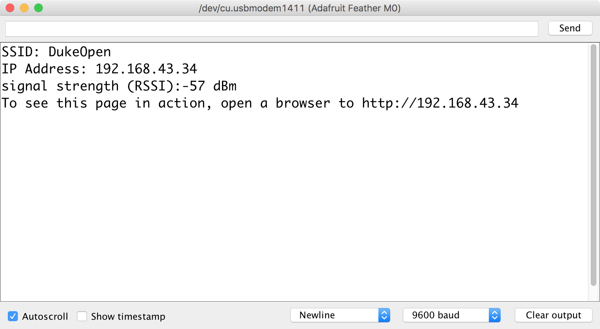
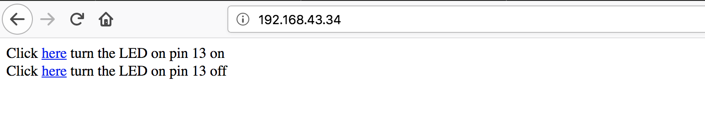

This tutorial walks through the setup process for registering your Feather M0 on Duke's network and setting up your Arduino IDE to program the device.

## About the Feather M0

For the remainder of the semester we will be working with the [Adafruit Feather M0](https://www.adafruit.com/product/3010), a powerful Arduino-compatible microcontroller with integrated wifi.  


Adafruit hosts [an excellent overview and setup guide](https://learn.adafruit.com/adafruit-feather-m0-wifi-atwinc1500/overview) for the Feather M0.  Please consult it alongside this setup tutorial.

## Register on DukeReg

Before we can use the Feather M0's wifi capabilities on Duke's network, we need to register its Mac address on [DukeReg](https://dukereg.duke.edu/) so that Duke's network will recognize it as an authorized device.

1.  First, locate your Feather M0's Mac address, located on the white sticker on the Feather's wifi chip (outlined in red in the image below):
    

1. Next, open a web browser to [https://dukereg.duke.edu/](https://dukereg.duke.edu/).  You will be prompted to enter your NetID and password.

1.  Click on the green button to "Register a New Device."
    

1.  In the subsequent form, type the Mac address as it appears on your Feather.  Give your device a name ("Feather M0") and choose "Other" for OS and "Personal" for Ownership.
    

1. Click on the blue "Register" button.

1. The page should refresh, indicating that the "Device was successfully registered.

1.  Click on the "Back" button to return to your list of registered devices.

1.  Confirm that the Mac address you submitted matches the Mac address on your Feather M0.  If it does not match, click the Delete button next to the mis-typed entry and then create a new registration.

Duke's network may take up to 45 minutes to propagate this authorized registration to all its wifi endpoints.   

## Configure the Arduino IDE

In this next section, we'll configure the Arduino IDE to recognize the Feather M0 microcontroller.

1.  Launch the Arduino IDE program.

1.  Open up the Preferences pane.  (On OS X, this is under the main menu: Arduino --> Preferences.  On Windows, it is acccessible under File --> Preferences.)

1.  Be sure to check the box next to "Display Line Numbers."

1.  Next, click on the icon to the far right of the "Additional Boards Manager URLs" textbox.  
    

1.  A dialog box will pop up.  In this box you will see any previous custom board definition URLs you may have entered (such as the [ATtiny package from Github user damellis](http://highlowtech.org/?p=1695)):
       

    On a new line, enter the following URL:

    ```
    https://adafruit.github.io/arduino-board-index/package_adafruit_index.json
    ```   

    and then click the "OK" button.

1. Click the "OK" button in the Preferences pane to save your changes.

1.  Now we are ready to add the board definitions to Arduino so that we can program the Feather MO.

    1. Open the Boards Manager under the main menu:  Tools --> Board --> Boards Manager:
    

    1. We will need to install two sets of board definitions.  First, scroll down until you find "Arduino SAMD Boards (32-bits ARM Cortex-M0+) by Arduino".  Click "Install" to download and install the latest version.

    1.  Further down the list you should also fine "Adafruit SAMD Boards by Adafruit."   Click "Install" to download and install the latest version of this set of board definitions.

    !!! failure "Don't See the Adafruit SAMD option?"

        If the Adafruit SAMD Boards option does not appear on your list of possible board definitions to install, you may have entered the URL incorrectly in step #5 above.  Return to your Preferences pane to verify.
    
    1. Click the "Close" button to close the Boards Manager.

1.  **Windows users only:**  Download and install the [latest Adafruit Drivers Package](https://github.com/adafruit/Adafruit_Windows_Drivers/releases/latest).

1.  Restart the Arduino IDE application.

1.  Check to see that the "Adafruit Feather M0" appears as an option under Tools --> Board
    


## Blink 

Now that you've configured the Arduino IDE to recognize the Feather M0, let's test it with a simple Blink sketch.

1.  Use the USB cable to plug your Feather M0 into an available USB port on your computer.

1.  Open the default Blink sketch.  From the main menu, choose File --> Examples --> 01.Basics --> Blink

1.  Make sure you have the `Adafruit Feather M0` selected under Tools --> Board.

1.  Choose Tools --> Port and select the USB port for your board.

1.  Click the Upload button (or choose Sketch --> Upload)

The onboard LED on the Feather M0 should blink on and off every second.


## Feather M0 as Webserver

Next we'll make use of the WiFi101 library to enable the Feather M0's wifi chip and use it to serve up a webpage from the Feather itself that can be used to control the onboard LED.

1.  From the main menu, choose Sketch --> Include Library --> Manage Libraries.

1.  In the Library Manager dialog box that appears, type "Wifi101" in the _Filter your search..._ text box.

1. The WiFi101 library should appear at the top of the search results.  

1. Click the "Install" button to install the latest version of the library.

1. Click the "Close" button to return to the main programming interface.

1.  From the main menu, choose File --> New to start a new sketch.

    We will make use of Tom Igoe's Nov 2012 SimpleWebServerWiFi sketch to create a simple web server that lets you blink an LED via the web.
    
    This sketch will print the IP address of your WiFi connection (once connected) to the Serial monitor. From there, you can open that address in a web browser to turn on and off the Feather's built-in LED (pin 13).

    If the IP address of your shield is yourAddress:
    
    * http://yourAddress/H turns the LED on
    * http://yourAddress/L turns it off


1.  Copy and paste the following code into your sketch, replacing what is there by default:   

    ```arduino

    #include <SPI.h>
    #include <WiFi101.h>

    char ssid[] = "DukeOpen";  // your network SSID (name)
    // char pass[] = "";   // commented out because password
    // is not used with DukeOpen

    int status = WL_IDLE_STATUS;
    WiFiServer server(80);
    int ledPin = 13;   // specify built-in LED

    void setup() {
      Serial.begin(9600);// initialize serial communication
      pinMode(ledPin, OUTPUT);   // set the LED pin mode
      // Configure pins specific to Adafruit ATWINC1500 Feather M0
      WiFi.setPins(8, 7, 4, 2);
      // check for the presence of WiFi:
      if (WiFi.status() == WL_NO_SHIELD) {
        Serial.println("WiFi not present");
        while (true);      // don't continue
      }
      // attempt to connect to WiFi network:
      while ( status != WL_CONNECTED) {
        Serial.print("Attempting to connect to Network named: ");
        Serial.println(ssid);  // print the network name (SSID);
        // Connect to open network.
        status = WiFi.begin(ssid);
        // if using password WEP, use the following instead
        // status = WiFi.begin(ssid, pass);
        // wait 10 seconds for connection:
        delay(10000);
      }
      server.begin();    // start the web server on port 80
      printWiFiStatus(); // you're connected now, so print out the status
    }

    void loop() {
      WiFiClient client = server.available();  // listen for incoming clients
      if (client) {  // if you get a client,
        Serial.println("new client");  // print a message out the serial port
        String currentLine = "";       // make a String to hold incoming data from the client
        while (client.connected()) {   // loop while the client's connected
          if (client.available()) {  // if there's bytes to read from the client,
            char c = client.read();// read a byte, then
            Serial.write(c);   // print it out the serial monitor
            if (c == '\n') {   // if the byte is a newline character
              // if the current line is blank, you got two newline characters in a row.
              // that's the end of the client HTTP request, so send a response:
              if (currentLine.length() == 0) {
                // HTTP headers always start with a response code (e.g. HTTP/1.1 200 OK)
                // and a content-type so the client knows what's coming, then a blank line:
                client.println("HTTP/1.1 200 OK");
                client.println("Content-type:text/html");
                client.println();
                // the content of the HTTP response follows the header:
                client.print("Click <a href=\"/H\">here</a> turn the LED on pin 13 on&lt;br />");
                client.print("Click <a href=\'/L\'>here</a> turn the LED on pin 13 off");
                // The HTTP response ends with another blank line:
                client.println();
                // break out of the while loop:
                break;
              }
              else {
                // if you got a newline, then clear currentLine:
                currentLine = "";
              }
            }
            else if (c != '\r') {
              // if you got anything else but a carriage return character,
              currentLine += c;     // add it to the end of the currentLine
            }
            // Check to see if the client request was "GET /H" or "GET /L":
            if (currentLine.endsWith("GET /H")) {
              digitalWrite(ledPin, HIGH);// GET /H turns the LED on
            }
            if (currentLine.endsWith("GET /L")) {
              digitalWrite(ledPin, LOW); // GET /L turns the LED off
            }
          }
        }
        // close the connection:
        client.stop();
        Serial.println("client disonnected");
      }
    }

    void printWiFiStatus() {
      // print the SSID of the network you're attached to:
      Serial.print("SSID: ");
      Serial.println(WiFi.SSID());
      // print your WiFi shield's IP address:
      IPAddress ip = WiFi.localIP();
      Serial.print("IP Address: ");
      Serial.println(ip);
      // print the received signal strength:
      long rssi = WiFi.RSSI();
      Serial.print("signal strength (RSSI):");
      Serial.print(rssi);
      Serial.println(" dBm");
      // print where to go in a browser:
      Serial.print("To see this page in action, open a browser to http://");
      Serial.println(ip);
    }

    ```  

    1. Verify the code to make sure it compiles.

    1. Ensure that you still have the Adafruit Feather M0 selected under Tools --> Board and the correct USB port under Tools --> Port.   Then click the Upload icon to upload the code to your Feather M0.

    1. Once the code successfully compiles and uploads, click on the "Serial Monitor" icon in the upper-right of the Arduino sketch interface, or choose Tools --> Serial Monitor from the main menu.

    1. In the serial monitor, after about 10 seconds you should see the Feather connect to the wifi network and receive an IP address.  Make note of the IP address that your Feather M0 has been assigned.

        

    1. Open a browser window and enter "http://" followed by the IP address in the address bar.   The browser should open the following webpage, which is being served directly from the Feather M0:

        

    1. Click on the links on the webpage to toggle the Feather M0's onboard LED on and off.

