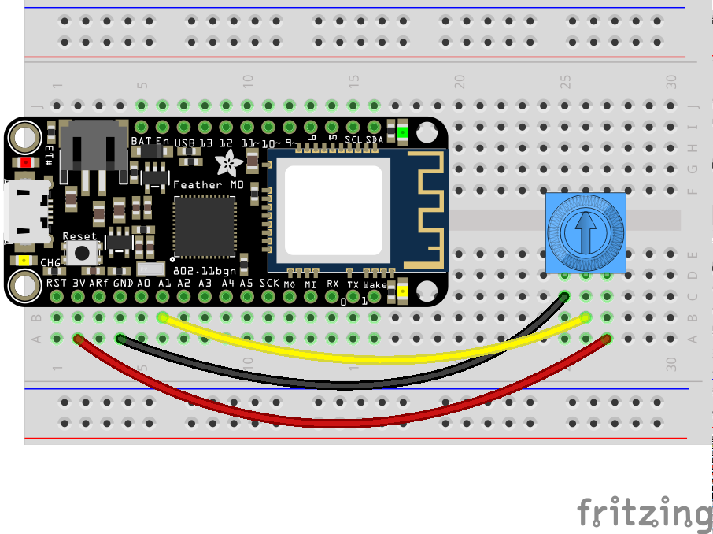
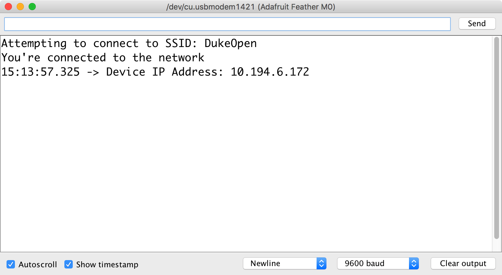
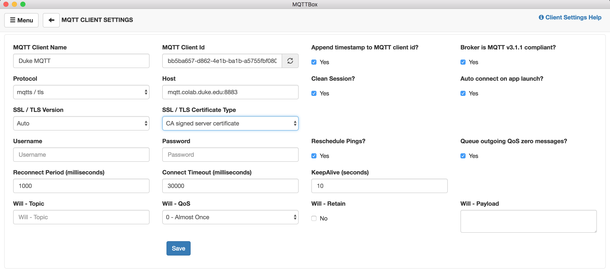
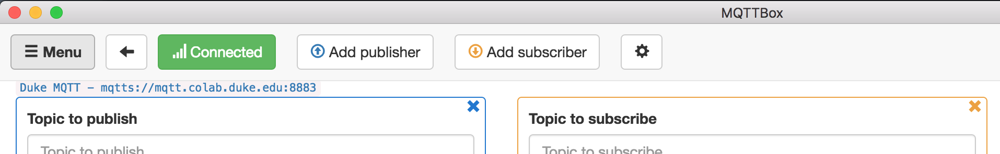

## About this Tutorial

This tutorial outlines a workflow for implementing [MQTT communication](https://www.hivemq.com/blog/mqtt-essentials/) on the Adafruit Feather M0, leveraging the following Arduino libraries:

* [WiFi101 by Arduino](https://www.arduino.cc/en/Reference/WiFi101)
* [PubSub Client by Nick O'Leary](https://pubsubclient.knolleary.net/)
* [arduino-timer by Michael Contreras](https://github.com/contrem/arduino-timer)

Before you begin, please install these libraries using the Arduino IDE's [Library Manager](https://www.arduino.cc/en/Guide/Libraries#toc3).

For the purposes of this tutorial, imagine that you want to be able to control the lighting at the entrance of every administrative building on campus.  To accomplish this, you deploy a fleet of Feather M0's to each building.  Each Feather is connected to an LED light.  One Feather will function as your "control center", so it will need a potentiometer for setting brightness levels. 

As a baseline functionality, we want to be able to control the brightness level of ALL of the Feather-connected LEDs on the network, simultaneously adjusting them from one location.   

Let's prototype this:  Wire up a potentiometer to your Feather M0, terminating its wiper terminal at analog pin A1.   We will make use of the onboard LED (@ pin 13) to save some time but you are welcome to include an LED and appropriate resistor for a 3.3V logic level.



Once you've wired up your hardware like the image above, you can continue below with either the [Quick Start Guide](#quick-start-guide) that builds modularly off of a sample code, or with the [Detailed Instructions](#detailed-instructions), which walk step-by-step through the entire process of constructing a functioning project.

---
## Quick Start Guide

This Quick Start Guide will make use of a heavily commented codebase that has been structured to allow for easy setup and customization of an MQTT client node.

1. First, [download a .zip file of the code](https://gist.github.com/mjvo/4913d11adcc08d7188819c79e2186b99/archive/c031db38f15b88702a7a1e2f4e109c71d053ac6c.zip) and unzip it.

1. This zip file contains two files:  `MQTT_FeatherMO.ino` and `arduino_secrets.h`.  Rename the unzipped folder to `MQTT_FeatherMO`.  (Arduino requires that the containing folder name match the main .ino sketch name.)

1.  Double-click on the `MQTT_FeatherMO.ino` file to open it in Arduino.

1.  The sketch contains two tabs.  Click on the `arduino_secrets.h` tab and **set your WiFi network's SSID and password (if applicable)**.

    

1. Return to the MQTT_FeatherM0 tab.

1. Scroll down to lines 28 and 29 and **set your MQTT_BROKER address and MQTT_PORT**.   If your desired broker is TLS/SSL capable, you will use port 8883.  If not, use the default port 1883.  Since our broker, `mqtt.colab.duke.edu` is capable of TLS/SSL, lines 28 and 29 should read:

    ```arduino
    #define MQTT_BROKER "mqtt.colab.duke.edu"  // specify MQTT broker address (IP or URL)
    #define MQTT_PORT 8883  // use 8883 for TLS/SSL MQTT; use 1883 for non-secure
    ```

1.  Look at lines 31 - 35.  If your broker is NOT SSL/TLS capable, comment out line 32 and ***un***comment line 35.  In our case, since our broker is TLS/SSL enabled, we can leave these lines unchanged.

1. **Scroll down to the "PIN DECLARATIONS" section of the code**.  Here is where you would declare any constants to hold pin #'s for the hardware pins you need your project to employ.  In our case, we want to use pin `13` as `ledPin` and pin `A1` as `sensorPin`, so ***un***comment lines 54 and 55, as illustrated below:

    ```arduino hl_lines="9 10"
    // ****
    // PIN DECLARATIONS
    //
    // Pin declarations for Feather hardware control
    // Modify as necessary for your hardware setup.
    // Don't forget pinMode in the setup() function!
    // ****
    //  examples:
    const int ledPin = 13;   // onboard LED
    const int sensorPin = A1;  // analog input, such as potentiometer
    ```

1.  Next scroll all the way down to the sketch's `setup()` function and **find the "PINMODE DECLARATIONS" section.**  Here is where you will need to set the `pinMode` of any pins specified above.  In our case, we want to set the pinMode of `ledPin` to `OUTPUT` and of `sensorPin` to `INPUT`.  ***Un***comment lines 181 and 182, as indicated below:

    ```arduino hl_lines="5 6"
        // ****
        // PINMODE DECLARATIONS
        // Any pinMode declarations should be set here
        // ****
        pinMode(ledPin, OUTPUT);
        pinMode(sensorPin, INPUT);
    ```

1. Scroll back up to the "SUBSCRIPTIONS SECTION" (around line 60).  If your project needs to _subscribe_ to any MQTT topics, here is where you both a) **subscribe to the topic(s)** and b) **specify what your Feather M0 should do upon receiving an incoming message at that topic(s)**.  

    1.  Continue to Part A:  `doSubscriptions()`:  Here you can specify -- one per line -- any topics that you would like your Feather M0 to subscribe to from the MQTT broker.  These follow the syntax `client.subscribe("/some/topic");`  

        Let's specify a subscription to the topic `/admin/lightlevel`.   Add this line to the `doSubscriptions()` function, _before_ its closing `}`, as illustrated below:

        ```arduino hl_lines="6"
        void doSubscriptions() {
            // Specify topic subscriptions line by line below, such as
            // client.subscribe("/some/topic");
            // client.subscribe("/another/topic");

            client.subscribe("/admin/lightlevels");
        }
        ``` 

    1. Next we need to **specify what happens when the Feather receives an MQTT message at a subscribed topic**.  Scroll down and find "PART B - Handle parsing of specific topics below..."

        Here we do a string compare of the incoming topic against a specific topic we expect to receive and parse that message accordingly.  The generic syntax for such parsing is:

        ```arduino
            if (strcmp(topic, "/some/topic/") == 0){
                //Do something with its payload
            }
        ```

        In our case, we want to do something when a message comes in at topic `/admin/lightlevel`, namely, adjust the onboard LEDs brightness.  Add the following code immediately below the line `/////// TOPIC SPECIFIC PARSING GOES HERE` (approx line 116) and *above* the closing `}` for the `parseMQTT()` function (approx. line 118 )

        ```arduino
            //this listens for a topic called "/admin/lightlevel"
            // and then converts its payload string into an integer
            // using the atoi() function. It then sets the ledPin level
            // accordingly using the analogWrite() function
            if (strcmp(topic, "/admin/lightlevel") == 0) {
                int brightness = atoi((char*)payload);
                Serial.print("Brightness: ");
                Serial.println(brightness);
                if (brightness < 3){
                    analogWrite(ledPin, 0); // Turn LED fully off 
                    Serial.println("All OFF");
                }
                else if (brightness > 252){
                    analogWrite(ledPin, 255); // Turn LED fully on 
                    Serial.println("All ON");
                }
                else {
                    analogWrite(ledPin, brightness); // set ledPin brightness
                }
            }
        ```
    
    If all we need to do in our project was subscribe to MQTT topics and parse incoming messages at those topics, we could stop here.  However, we also need at least one of our nodes to be publishing sensor data (in this case, potentiometer settings) to the MQTT broker.

1. Scroll down to the "MQTT PUBLISHING SETUP" section.  Here you can first **set one or more intervals for the Feather to trigger PubSub `publish()` functions**.  A single interval can trigger any number of publish events.  For example, you might want to publish to four different topics every 500 ms.  And/or different intervals can be set for different topics.  For example, you may wish to publish the value of a potentiometer every 100 ms but a temperature reading only every 15 minutes. 

    We want the client LEDs to be quickly notified of any changes in the potentiometer setting so that they can update their brightness in near real-time.  So we'll set up a 100 ms interval for our publishing.  Under Part 1, find the `setPubIntervals()` function and inside the function, add the following line as highlighted below:

    ```arduino hl_lines="4"
    void setPubIntervals() {
        // syntax:  doPub.every(milliseconds, callbackFunction);
        //doPub.every(100, someFunc);  // call the someFunc() function every 100 ms
        doPub.every(100, publishLightlevel);
    }
    ```

1. Finally, you need to **write the callback functions specified in the interval timers above**.  The generic syntax is:

    ```arduino
    bool someFunc(void *) {
        client.publish("/some/topic", "value_as_string", false); // true:false --> retained
        return true; // repeat --> true
    }
    ```

    In the example below, every 100 ms (the interval set in Part 1 above), the function `publishLightlevel()` executes, which reads the analog value at sensorPin, maps it to a value between 0 - 255 (8 bit) and then converts that numerical value to a character array c string.  It then publishes that value to MQTT topic `/admin/lightlevel` with a retain flag set to `false`.

    Insert the code below at line 172 (`/////////  doPub callback functions go here`):

    ```arduino
    /////////  doPub callback functions go here
    bool publishLightlevel(void *) {
        int reading = analogRead(sensorPin); // read the potentiometer
        reading = map(reading, 0, 4095, 0, 255);  // Feather M0 set to 12-bit ADC
        
        char value[3];
        String msg = String(reading);
        msg.toCharArray(value, 3);
        
        client.publish("/admin/lightlevel", msg.c_str(), false);
        return true; // repeat? true
    }
    ```

1.  **Verify and upload the sketch** to your Feather M0. 

1.  Once your Feather connects to Wifi and to the MQTT broker, manipulating the potentiometer should dynamically adjust the brightness of your onboard LED.


---

## Detailed Instructions

### Part 1 - WiFi Connection

As you learned in our [initial Feather tutorial](/circuits/feather/#feather-m0-as-webserver), connecting to the internet requires using the Arduino WiFi library so that the Feather's ATSAMD21G18 ARM Cortex M0 processor can communicate with its Atmel WINC1500 WiFi chip.   Let's begin by walking through the steps necessary to connect the Feather to a WiFi network.

1.  Launch the Arduino IDE.

1.  Create a new sketch by choosing File --> New from the main menu.

1.  Save that sketch as "MQTT_FeatherM0_Prototype" by choosing File --> Save from the main menu.

1.  Ensure that you have "Adafruit Feather M0" selected under Tools --> Board.

1.  Add the WiFi101 and SPI libraries to your sketch by either:

    * Choosing Sketch --> Include Library --> WiFi101
        and Sketch --> Include --> SPI
      
      -- _or_ --

    * Typing the following code at lines 1 and 2 of your sketch:
        
        ```arduino
        #include <SPI.h>   
        #include <WiFi101.h>
        ```

1.  It's considered a best practice to keep your WiFi access credentials in a separate header file.  To create one, find the &#9662; symbol and left-click on it.  In the pop-up, choose New Tab.

    

    _(Alternatively, you can press SHIFT-&#8984;-N)_

1. You will be prompted to enter a name for this new tab.  Type:

    `arduino_secrets.h`


1.  A new tab will appear in your IDE workspace, as indicated below:

    

    In this tab you will want to create [defined constants](https://www.arduino.cc/reference/en/language/structure/further-syntax/define/) for your ssid and wifi password (if a password is required for your wifi network):

    ```arduino
    #define SECRET_SSID "DukeOpen"  // your network SSID (name)
    #define SECRET_PASS ""  // your network password; leave empty for open networks
    ```

    In the above example, the SSID is set to the open network, `DukeOpen` with _no password_.

1.  Save your sketch:  File --> Save Return to the main tab of your Arduino sketch.

1.  Between the library `#include` section and the `void setup()` function, add the following lines:

    ```arduino
    // WiFi credentials and config
    #include "arduino_secrets.h"
    char ssid[] = SECRET_SSID;
    char pass[] = SECRET_PASS;
    int status = WL_IDLE_STATUS;  // variable for WiFi radio's status

    WiFiSSLClient WiFiclient; // instantiate a secure WiFi client
    // use WiFiClient WiFiclient; for non-secure connections
    ```

    This instantiates several variables necessary for WiFi connectivity and signals to the WiFI101 library that we wish to create an SSL-capable WiFi connection.  If you don't need a secure connection, use `WiFiClient WiFiclient;` instead.

1.  Next, turn your attention to the `void setup()` function, replacing it with the following code:

    ```arduino
    void setup(){
        // Initialize Serial (useful for debugging)
        Serial.begin(9600);

        // Feather M0-specific WiFi pins
        WiFi.setPins(8, 7, 4, 2);

        // attempt to connect to WiFi network:
        while ( status != WL_CONNECTED) {
            Serial.print("Attempting to connect to SSID: ");
            Serial.println(ssid);
            // Connect to WiFi:
            if (sizeof(pass) == 1) { // if no password
                status = WiFi.begin(ssid); // connect with SSID alone
            }
            else {
                status = WiFi.begin(ssid, pass); // connect with SSID and password
            }

            // wait 5 seconds for connection:
            delay(5000);
        }

        // you're connected now, so print out a success message:
        Serial.println("You're connected to the network");

        // print your Feather's IP address:
        IPAddress ip = WiFi.localIP();
        Serial.print("Device IP Address: ");
        Serial.println(ip);
    }
    ```

1.  Save and verify your Sketch.

1.  Plug in your Feather M0 to the USB port of your computer.  

1.  Confirm that its USB port is recognized and selected in the Arduino IDE:  Tools --> Port

1.  Upload the code to your Feather and open your Serial Monitor.

1.  Your Feather should connect to your desired network and indicate a successful connection on the Serial Monitor:

    

---

### Part 2 - MQTT Connection

Next we need to add the code necessary to make a [connection to an MQTT broker](https://www.hivemq.com/blog/mqtt-essentials-part-3-client-broker-connection-establishment).  We will use the [PubSub Client by Nick O'Leary](https://pubsubclient.knolleary.net/) to connect to our broker.

**Broker**:  mqtt.colab.duke.edu
**Port**:  8883 (TLS/SSL)

The above broker is hosted on a virtual machine created using Duke's [Virtual Computing Manager](https://oit.duke.edu/what-we-do/services/virtual-computing-manager) service.  If there is interest, a future tutorial will outline how to set up and configure this service, leveraging the open source MQTT broker [Mosquitto](https://mosquitto.org/) and for secure connectivity, [EFF's Certbot](https://certbot.eff.org/lets-encrypt/ubuntubionic-other) and [Let's Encrypt certificates](https://letsencrypt.org/).

For now, let's simply make use of this existing broker.

1.  To include the PubSub Client library, add this code below the `#include` statement for the WiFi101 library at the very top of your sketch:

    ```arduino
    #include <PubSubClient.h>
    ```

1. Next, add the configuration variables required by the PubSub Client.  Add the highlighted lines _below_ the line instantiating a secure WiFi client:

    ```arduino hl_lines="4 5 6 7 8 9 10 11 12 13 14 15 16"

    WiFiSSLClient WiFiclient; // instantiate a secure WiFi client for TLS/SSL
    // use WiFiClient WiFiclient; for non-secure connections

    // MQTT configuration
    #define MQTT_BROKER "mqtt.colab.duke.edu"  // specify MQTT broker address (IP or URL)
    #define MQTT_PORT 8883  // use 1883, or 8883 for TLS/SSL

    // use WiFi connection for MQTT communication
    PubSubClient client(WiFiclient); 

    // each MQTT client should have a unique ID
    String device_id = "FeatherM0-";  // this will be used with Mac address for uniqueness

    // variables for non-blocking MQTT reconnection
    long lastReconnectAttempt = 0;
    long now;

    void setup(){
    ```
    The code above specifies some defined constants for the MQTT broker and port, and then tells the PubSub client to use the WiFiClient as a communication channel.  The rest of the code sets up some variables to be used later.
    
1.  At the end of your `setup()` function (but before its closing `}`), add the following:

    ```arduino
        // get your Feather's MAC address:
        byte mac[6];
        WiFi.macAddress(mac);
        String mac_address;
        for (int i = 5; i <= 0; i--) {
            if (mac[i] < 16) mac_address += "0";
            mac_address += String(mac[i], HEX);
            if (i > 0) mac_address += ":";
        }
        // append mac_address to device_id
        // for unique identification
        device_id += mac_address;

        // initiate first connection to MQTT broker            
        client.setServer(MQTT_BROKER, MQTT_PORT);

        // specify a function to call upon receipt of a msg
        // on a subscribed channel; in this case parseMQTT()
        //client.setCallback(parseMQTT);
        
        // print info on MQTT broker
        Serial.print("Attempting to connect to MQTT Broker: ");
        Serial.print(MQTT_BROKER);
        Serial.print(":");
        Serial.println(MQTT_PORT);
        lastReconnectAttempt = 0;   
    
    ```
    
    This code will get your Feather's hardware mac address and write it to the variable `mac_address.`  Then it concatenates "FeatherM0-" with your Feather's hardware mac address, rendering a unique identifier for your Feather when communicating with an MQTT broker.  

    The `client.setServer()` function configures the PubSub client to connect to the specified MQTT broker and port.

    The `client.setCallback()` function indicates what function to call whenever the PubSub client receives an incoming message on a subscribed channel.   In this case, it will call the `parseMQTT()` function, which we have yet to define.  Consequently, let's leave the `client.setCallback()` line commented out for now.

1.  We're getting close to having our code in place to connect our Feather to the MQTT broker.  Scroll to the bottom of your Arduino code and replace the `setup()` function with the following code:

    ```arduino
    void loop(){
        // get the current time
        now = millis();

        // if MQTT connection lost
        if (!client.connected()) {
            // only attempt to reconnect every 5 secs
            if (now - lastReconnectAttempt > 5000) { // 5 secs since last reconnect attempt?
            lastReconnectAttempt = now;
            // Attempt to reconnect
            if (reconnect()) {
                lastReconnectAttempt = 0;
            }
            }
        } else {
            // MQTT client connected
            client.loop();
        }
    }
    ```

    This code checks to see if the PubSub client is connected to the MQTT broker; if not, it waits 5 seconds and attempts to connect by running the `reconnect()` function, which we will define in the next step.  If unsuccessful, it waits another five seconds and tries again.  If successful, it runs the PubSub `client.loop()` function, which continually checks that the connect is live and listens for incoming messages.

1.  Finally, add the following `reconnect()` function below the `loop()` function (**after** the `loop()` function's closing `}`.)

    ```arduino
    boolean reconnect() {
        if (client.connect(device_id.c_str())) {
            Serial.print(device_id);
            Serial.println(" connected to MQTT broker");

            return client.connected();
        }
        Serial.print("MQTT connection failed, rc=");
        Serial.println(client.state());
        Serial.println("Trying again ...");
        return 0;
    }
    ```

1. Verify and upload the code to your Feather M0.  Open the Serial Monitor and confirm that you are successfully connecting to both your desired wireless network (e.g. DukeOpen) and MQTT server, as indicated in the image below:

    

---

### Part 3:  MQTT Subscriptions

MQTT protocol allows clients to subscribe to "topics" that may be published by other clients connected to the same MQTT broker.  Client subscriptions are "blind" in that clients have no way of verifying if any other clients are publishing at that topic.  

In the Arduino PubSub library, the function to subscribe to a topic is `.subscribe("/some/topic"` and must be called _after_ a successful connection to the MQTT broker.   

In our project, we want client Feather M0's in each administrative building to subscribe to the same topic (e.g. `/admin/lightlevel`) and use the information published to that topic to set the level of an attached LED.  Let's set this up now. 

1.  Right above the `setup()` function, declare a variable for the attached LED at pin 13:

    ```arduino
    const int ledPin = 13;   // onboard LED
    ```

1. Within the `setup()` function, set the `pinMode` of `ledPin` to `OUTPUT`:

    ```arduino
        pinMode(ledPin, OUTPUT);
    ```

1.  Next, create a new function **outside** of the `setup()` and `loop()` functions called `doSubscriptions()` and subscribe to the topic `/admin/lightlevel` as highlighted below:

    ```arduino hl_lines="5"
    void doSubscriptions() {
        // specify topic subscriptions line by line below, such as
        // client.subscribe("/some/topic/");
        // client.subscribe("/another/topic/");
        client.subscribe("/admin/lightlevel");
    }
    ```

1.  We need to call this `doSubscriptions()` function after we establish an MQTT connection, so find the function called `reconnect()` and add the highlighted line below:

    ```arduino hl_lines="5"

    boolean reconnect() {
        if (client.connect(device_id.c_str())) {
            Serial.print(device_id);
            Serial.println(" connected to MQTT broker");
            doSubscriptions();  // (re)subscribe to desired topics
            return client.connected();
        }
        Serial.print("MQTT connection failed, rc=");
        Serial.println(client.state());
        Serial.println("Trying again ...");
        return 0;
    }
    ```

1. Now that we have subscribed to the desired topic, we need to add a function to our sketch that parses the incoming messages and executes some code on our Feather to change the onboard LED's brightness.
    
    1.  Recall in Part 2, #3 we left the `setCallback()` function commented out?  Find that line in your `setup()` function and ***un***comment it:

        ```arduino hl_lines="6"
            // initiate first connection to MQTT broker            
            client.setServer(MQTT_BROKER, MQTT_PORT);

            // specify a function to call upon receipt of a msg
            // on a subscribed channel; in this case parseMQTT()
            client.setCallback(parseMQTT);
        ```
        This means that every time the PubSub client receives an incoming message at a suscribed topic, the `parseMQTT()` function will execute. 

    1.  Let's create that function, adding the following to your sketch:

        ```arduino
        void parseMQTT(char* topic, byte* payload, unsigned int length) {
  
            payload[length] = '\0';  // important - do not delete

            // Handle parsing of specific topics using the "string
            // compare" function to differentiate among topics
            if (strcmp(topic, "/admin/lightlevel") == 0) {
                int lightlevel = atoi((char*)payload);
                Serial.print("Light level: ");
                Serial.println(lightlevel);
                analogWrite(ledPin, lightlevel);
            }
        }
        ```

        The code above will trigger upon message receipt, compare the `topic` of the MQTT message, and if it matches `admin/lightlevel` it will convert the message `payload` from a character array to an integer and use it to set the PWM analog level of pin 13.
    
1.  Verify your code and upload it to your Feather M0.

1.  If you would like to test your subscription now, you will need to download an MQTT client for your computer.  If not, you can skip down to [Part 4: MQTT Publishing](#part-4-mqtt-publishing).

    1.  Download and install [MQTTBox](http://workswithweb.com/mqttbox.html) (available for Mac, Linux, and Windows).

    1.  Once installed, launch the application.

    1.  Click on the "Create MQTT Client" button.

    1.  In the settings, use the following for `mqtt.colab.duke.edu`:

        * Client Name:  Duke MQTT
        * Protocol:  mqtts / tls
        * Host:  mqtt.colab.duke.edu:8883
        * SSL / TLS Version:  auto
        * SSL / TLS Certificate Type:  CA signed server certificate
    
    1.  The rest of the settings can be left unchanged.

        

    1.  Click on the "Save" button.

    1. The resulting screen should indicate that MQTTBox has successfully connected to the broker with a green "Connected" indicator:

        
    
    1.  In the "Topic to Publish" pane, enter the following:

        * Topic to publish:  /admin/lightlevel
        * Payload: 255

    1. Then click the blue "Publish" button.  

    1. Click it again.  Each time you click "Publish" you should get a notification at the bottom of the "Topic to Publish" pane indicating a message was published.

        

    1. Check your Feather M0's onboard LED.  It should shine at full brightness. 

    1.  In MQTTBox, change the `Payload` from `255` to `0` and then click the Publish button again.  Your Feather M0's onboard LED should turn off.

    1.  Try `127` as a payload.  Your LED should shine at 50% brightness.

If you were to deploy a fleet of Feather M0's in each admin building this is the extent of the code you would need to install on each Feather.  One Feather will need to serve as the "control," where an attached potentiometer will publish a value to `/admin/lightlevel` that each subscribed Feather will process to adjust their LED brightness.  We will set up this publish functionality in the next part. 

---

### Part 4:  MQTT Publishing

Finally, in this section we will make use of [Michael Contreras' arduino-timer library](https://github.com/contrem/arduino-timer) to publish potentiometer data from our Feather M0 to the topic `/admin/lightlevel`.  

1.  At the top of your sketch, include the arduino-timer library:

    ```arduino hl_lines="4"
    #include <SPI.h>
    #include <WiFi101.h>
    #include <PubSubClient.h>
    #include <timer.h>
    ```

1. Find where you declared the constant `ledPin` and add a line for the potentiometer attached to analog pin A1:

    ```arduino hl_lines="2"
    const int ledPin = 13;   // onboard LED
    const int sensorPin = A1;  // potentiometer attached to A1
    ```

1. In your `setup()` function, use `pinMode()` to set `sensorPin` as an input and also specify that the Feather M0's ADC can function at 12-bit resolution:

    ```arduino hl_lines="2 3 4 5 6"
        pinMode(ledPin, OUTPUT);
        pinMode(sensorPin, INPUT);
  
        // default Arduino ADC resolution is 10-bit
        // but we can set it to the Feather M0 native resolution of 12-bit
        analogReadResolution(12); // gives values of 0 - 4095
    ```

1. Next, we'll make use the arduino-timer library to set up a publication interval of 100 milliseconds for publishing our potentiometer data.  Just above the `setup()` function, add the following:

    ```arduino
    auto doPub = timer_create_default(); // create a timer with default settings

    void setPubIntervals() {
        // syntax:  doPub.every(milliseconds, callbackFunction);
        doPub.every(100, publishPot);  // call the publishPot() function every 100 ms
    }


    // In this example, every 100 ms (set in setPubIntervals above),
    // this function executes, which reads the analog value at sensorPin,
    // maps it to a value between 0 - 255 (8 bit) and then converts
    // that numerical value to a character array c string

    bool publishPot(void *) {
        int reading = analogRead(sensorPin); // read potentiometer
        reading = map(reading, 0, 4095, 0, 255);  // Feather M0 set to 12-bit ADC
        char value[3]; // instantiate a character array to hold reading
        String msg = String(reading); // put reading into msg
        msg.toCharArray(value, 3);  // convert msg to char array
        
        // publish to topic the msg as char * with a retained 
        // setting of false (do not retain)
        client.publish("/admin/lightlevel", msg.c_str(), false);
  
        return true; // repeat? true
    }
    ```

1. Next, add the following line at very end of your `setup()` function, but before its closing `}`:

    ```arduino
        setPubIntervals(); // initalize any publish intervals
    ```

1. Finally, add the following line at the very end of your `loop()` function, but before its clsing `}`:

    ```arduino
        doPub.tick(); // tick the doPub timer
    ```

1. Verify and then upload your sketch to your Feather M0.

1. Once your Feather connects to Wifi and to the MQTT broker, manipulating the potentiometer should dynamically adjust the brightness of your onboard LED, as well as the brightness of any other Feather M0 which is connected to MQTT broker `mqtt.colab.duke.edu` and subscribed to topic `/admin/lightlevel` using the message parsing above.

!!!note

    In my experience, a potentiometer wired to the Feather M0's analog pin and mapped to an 8-bit value never fully reaches 255 at the upper limit and never fully reaches 0 at the lower limit.  As a consequence, when testing the code above you may have found that your Feather's onboard LED never fully turns off.   

    To fix this, consider this code for parsing the `/admin/lightlevel` incoming message.  Replace your `parseMQTT()` function with:

    ```arduino
    void parseMQTT(char* topic, byte* payload, unsigned int length) {
        
        payload[length] = '\0';  // important - do not delete
        
        if (strcmp(topic, "/admin/lightlevel") == 0) {
            int brightness = atoi((char*)payload);
            Serial.print("Brightness: ");
            Serial.println(brightness);
            if (brightness < 3){
                analogWrite(ledPin, 0); // Turn LED fully off 
                Serial.println("All OFF");
            }
            else if (brightness > 252){
                analogWrite(ledPin, 255); // Turn LED fully on 
                Serial.println("All ON");
            }
            else {
                analogWrite(ledPin, brightness); // set ledPin brightness
            }
        }
    }
    ```

    This will give you a buffer at either end of the potentiometer where the LED will either be fully on or fully off.
    

---- 

Some things you could do to further enhance this project include:

* Save network bandwidth by triggering "publish" commands ONLY when the potentiometer value has changed since the last publish event.  There's no reason to publish every 100 milliseconds when the value of the potentiometer hasn't changed!

* Consider ways in which making use of the MQTT `retained` flag might make the entire system more robust.

* What changes would need to be made to the setup so that one could have potentiometer control at *every* node, where any one location can be used to control all of the other locations?