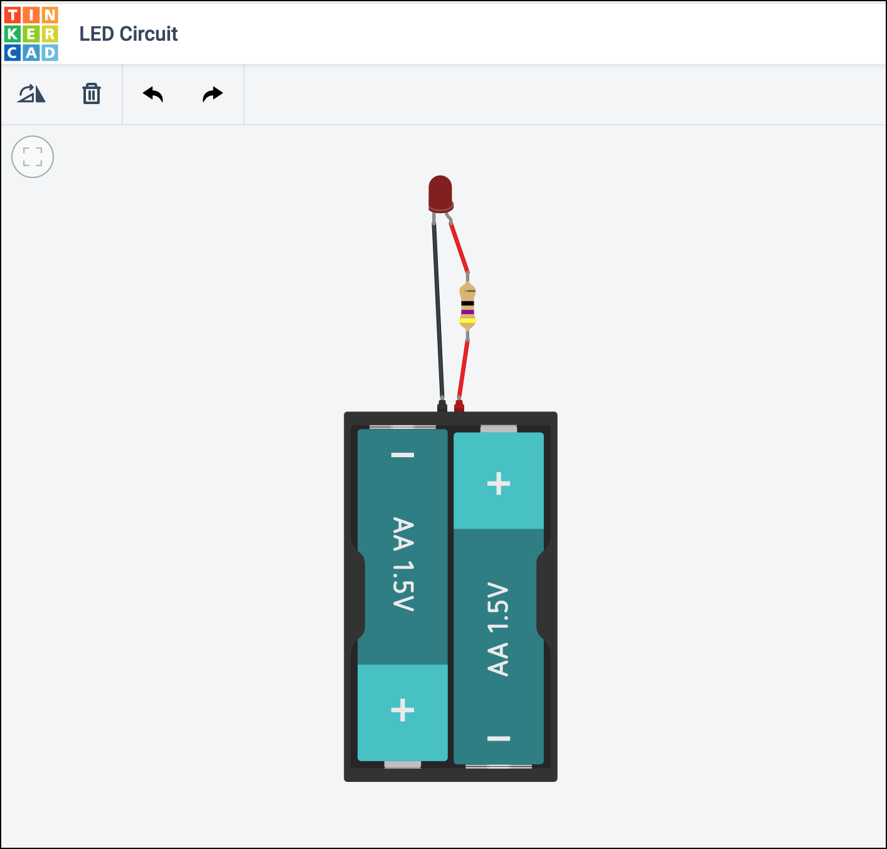

## Assumptions

The following tutorial assumes that:

1. You have created a Tinkercad / Autodesk account. (If you have not yet done so, please [create one](https://www.tinkercad.com/auth/shadowbox_register_fullscreen).)

1. You are [signed in](https://www.tinkercad.com/auth/shadowbox_fullscreen) using your account.

1. You have already completed the four tutorials in the [Circuits “Getting Started” Project Gallery](https://www.tinkercad.com/learn/#/learn/circuits/learning):

    * Start Simulating
    * Editing Components (we’ll cover Arduino in a future class; this just shows you how to modify components whose properties are editable.)
    * Wiring Components
    * Adding Components

1.  You have already completed the three [Circuits “Skill Builders Lessons”](https://www.tinkercad.com/learn/#/learn/circuits/lessons): 

    * Introducing the Breadboard
    * Ohm’s Law
    * Series and Parallel Circuits

---

## Circuit Setup

In this section of the tutorial you will create two identical circuits in the same Tinkercad Circuits workspace:  one without a breadboard, and the second using a breadboard.  Later in the tutorial we will use these circuits to gain a better understanding of current, resistance, and voltage. 

In both cases, you will be creating a simple LED circuit using a battery, LED, and resistor.  Here is the circuit diagram:

!!! question "**Calculate the Proper Resistor Value:**"
    
    The circuit diagram above indicates a 3V battery (2 x AA) and an LED with a forward voltage (voltage drop) of approximately 2.06V.  The LED's ideal forward current is 20mA.

    What is the ideal resistor value (in ohms) for this circuit?  In other words, what resistor (R) will keep the current (I) through the LED closest to 20mA, the current at which the LED will burn the brightest without jeopardizing its longevity or, worse, overloading?

    Use this formula (based on Ohm's Law and Kirchhoff’s voltage law):

    $$
    R = \frac{V_{source}-V_{drop}}{I_{forward}}
    $$

    ---

    Answer: 
    $$ R\ =\ \Rule{1cm}{0.15mm}{0.15mm} \ \Omega $$

  

### Circuit #1 - No Breadboard LED Circuit

1. Go to your Tinkercad Dashboard [https://www.tinkercad.com/#/dashboard](https://www.tinkercad.com/#/dashboard)

1. Click on the [Circuits button](https://www.tinkercad.com/#/dashboard?type=circuits&collection=designs) in the left panel.

1. Click on the green "Create new Circuit" button.

    <button data-md-color-primary="green">Create new Circuit</button>

    A new blank canvas will open in your browser.

1.  Using the Components Palette on the right, click and drag the following components into the canvas:

    * Resistor
    * LED
    * 1.5V Battery (AA)

1.  Click on the Battery in the canvas.  In the configuration panel that appears, set the "Count" to "2 Batteries" (e.g. we want a 3V supplied to our circuit, so 2 x 1.5V = 3V ).

1. Click on the Resistor in the canvas.  In the configuration panel that appears, set the Resistance to the Ω you calculated above.

1. Click and drag between terminals of your components to wire up your circuit.  If you wish, you may click on the individual wires to set their color.  

    After completing your wiring and arranging/rotating the components, your circuit should look something like this:

    

1. Click on the "Start Simulation" button in the upper-right of the browser window to simulate the circuit.  The LED should be brightly lit.

    !!! failure "**Troubleshooting**"

        If your LED is blown or shows a warning indicator, your calculated resistor value is too low.  Review your calculations.

        If your LED is dim, your calculated resistor value is too high.  Review your calculations.

        If your LED does not turn on at all, you may have mis-wired your circuit.  Check your connections and wire-routing.  Remember, LEDs are diodes and thus have polarity.

  

### Circuit #2 - LED Circuit on a Breadboard

Next, using the same canvas, let's create a breadboard version of the same circuit.  

1. Move the circuit you just created to the left or right of the canvas to give yourself space for the new circuit.

1.  Again, using the Components Palette on the right, click and drag the following components into the canvas:

    * Resistor
    * LED
    * 1.5V Battery (AA)
    * _**Breadboard**_

1. Set the Battery Count to 2.

1. Set the Resistor's resistance to the same Ω value you calculated for the non-breadboard circuit above.

1. Using wires and the breadboard, create the circuit.

    !!! hint

        Hovering your mouse over the breadboard rows will remind you [how a breadboard is configured](https://learn.sparkfun.com/tutorials/how-to-use-a-breadboard#anatomy-of-a-breadboard) (power buses on the outside rails, connected rows separated by a "ravine").

1.  After completing your wiring and arranging/rotating the components, your circuit should look something like this:

    

1.  Click on the "Start Simulation" button again in the upper-right of the browser window to simulate the circuit.  The LED on the breadboard should be brightly lit.

---

## Using a Multimeter

Now that we have a working circuit, let's use Tinkercad's virtual multimeter to take some measurements on our circuit.  

From the Components Palette, find the Multimeter and add it to your canvas.

Note that the multimeter has three modes.  By default, it will function in Voltage mode as a **`voltmeter`**, enabling you to read voltages across different points in your circuit.

The multimeter can be set to other modes easily by clicking on the multimeter in your canvas to display the configuration panel and selecting a different mode.  In Amperage mode, it will function as an **`ammeter`**, enabling you to read the current passing through specific points in your circuit.  In Resistance mode, it will function as an **`ohmmeter`**, enabling you to read the resistance between specific points in your circuit.

### Reading Voltages

We know that the total voltage of our circuit is 3V because the voltage differential between the cathode (+ terminal) and anode (- terminal) of the battery is 3V (assuming it is fully charged).

But let's read voltages between various points in the circuit.  

1. Read the voltage between the two sides of the resistor:

    

    !!! question "**Voltage Across the Resistor**"

        Fill in your reading below: 
        $$ Voltage\ =\ \Rule{1cm}{0.15mm}{0.15mm} \ V $$
 

2.  Read the voltage between the anode and the cathode of the LED:

    

    !!! question "**Voltage Across the LED**"

        Fill in your reading below: 
        $$ Voltage\ =\ \Rule{1cm}{0.15mm}{0.15mm} \ V $$
 

3.  Finally, read the voltage between the two terminals of the battery in the circuit.

    

    !!! question "**Voltage Across the Battery**"

        Fill in your reading below: 
        $$ Voltage\ =\ \Rule{1cm}{0.15mm}{0.15mm} \ V $$

        --- 

        If your voltage reading ≠ 3V, what do you think accounts for the difference?
                

4. What do you observe when you add the voltage across the resistor to the voltage across the LED?

    !!! question "**Total Voltage**"

        Fill in your reading below: 
        $$ V_{resistor} + V_{led} \ = \ \Rule{1cm}{0.15mm}{0.15mm} \ V $$

        --- 

        Observation:
                

### Reading Amperage

Finally, let's use the multimeter as an **`ammeter`** to measure the total current (I) being drawn by our circuit. 

!!! attention "Important"

    Remember: Voltmeter and ohmmeters are wired in **parallel** to the component being measured.  However, ammeters _must_ be wired in **series**.  See [https://learn.sparkfun.com/tutorials/series-and-parallel-circuits](https://learn.sparkfun.com/tutorials/series-and-parallel-circuits)

Wire your multimeter into your circuit in series as illustrated below:

!!! question "**Measuring Current**"

    What is the current being drawn by the circuit?   
    Provide your answer in both amps (A) and milliamps (mA)
            

    ---

    What happens to the current if you increase the voltage in the circuit, such as changing the battery from two AA's (3V) to 3 AA's (4.5V)?

            

    ---

    Similarly, what happens if you leave the voltage alone but increase the resistance in the circuit, such as increasing the resistance of the resistor to 100 Ω?

            
