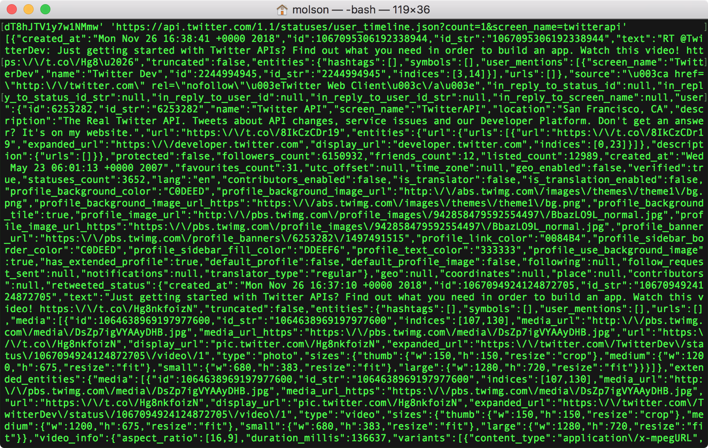
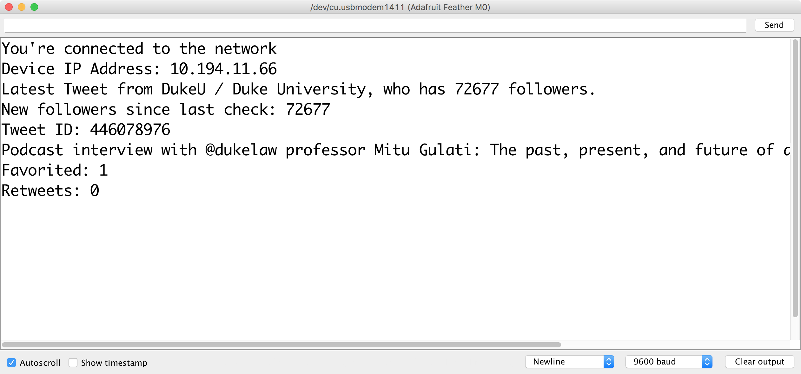

## About this Tutorial

Some of your projects require querying the API of an online service -- such as [Instagram]((https://www.instagram.com/developer/), [NASA](https://api.nasa.gov/), or [OpenWeatherMap](https://openweathermap.org/api) -- and then parsing the data sent back from the service.   [JSON](https://www.json.org/) (JavaScript Object Notation) is a common data format returned by API queries.  In this tutorial you will explore how to request JSON data from an API using an HTTP GET request and then how to parse that data for use by your Feather.  

Specifically, this tutorial outlines how to query the Twitter API and its ["Tweet JSON"](https://developer.twitter.com/en/docs/tweets/data-dictionary/overview/intro-to-tweet-json.html) data.  

## Install ArduinoJSON Library

First, install Benoit Blanchon's [ArduinoJson library](https://arduinojson.org/) into the Arduino IDE.   Proceed with the steps below and/or consult arduinojson.org's [official documentation](https://arduinojson.org/v5/doc/installation/).  

1.  Launch the Arduino application.

1. From the main menu, choose Sketch --> Include Library --> Manage Libraries

1. In the "Filter your search..." box, type `JSON`

1. Scroll down until you find "ArduinoJson by Benoit Blanchon"

    !!! important

        Do NOT immediately click Install.  The Library Manager lists the "beta" version by default, but for reliability, you will most likely want to use the latest "production" version.  As of the  of the writing of this tutorial, the latest version is:
        
        **`version 5.13.3`**

1. From the "Version" drop-down box, scroll down past all of the "X.X-beta" versions until you find the latest version non-beta version.  Click on that version to select it.

1. Finally, click the `Install` button and then `Close` once the library installation has completed.

## Twitter Setup

### Developer Access
To interact with Twitter's API, you will need a developer account and Twitter API keys.

1.  Go to [https://twitter.com/login](https://twitter.com/login) and sign in with your Twitter account credentials.

1.  Visit [https://developer.twitter.com/en/apply/user](https://developer.twitter.com/en/apply/user) to register your Twitter username for developer access.

    1. Your username should be selected by default.  Click "Continue."

    1. Next, select the "I am requesting access for my own personal use" radio button.

    1.  Enter a name for your developer account or project and select Primary Country of Operation.  Click "Continue"

    1.  On the next screen, choose your use case ("Student project / Learning to code").

    1.  Describe your project, such as:

        ```
        1. I am testing the Twitter API with an IoT device (Adafruit Feather M0)
        2. I want my own new Tweets, new followers and likes to my Tweets to trigger functions on my device. (light LEDs, etc)
        3.  No,  simply reading and responding to Twitter data
        4.  Content will not be displayed on device, except abstractly. [Of course, if you will display Twitter content (such as on an Arduino-connected LCD) you should say so here and describe its use case.]
        ```

    1.  Select `No` for "Will your product, service, or analysis make Twitter content or derived information available to a government entity?"

    1.  Read and accept the Terms of Service.

    1.  Finally, check your email inbox for a verification email.  In the email, click the "Confirm Your Email" button.

1.  Now you are ready to create your first Twitter app.  Visit [https://developer.twitter.com/en/apps](https://developer.twitter.com/en/apps) and click on the "Create an App" button.

1.  Enter the App details (these can be modified later):

    1.  Name: `vms564s_app`

    1. App Description:  `This app enables connectivity to an IoT device`

    1.  Website URL: `https://aahvs.duke.edu`

    1. Tell us how this app will be used: `This app is for a class project for VMS564S  Physical Computing and the Internet of Things at Duke University.`

1.  Click the Create button.  You will be taken to a summary page.  Verify and/or edit the information as needed.

1. Click on the Permissions tab.  For our purposes, we only need "Read-only" access.  If you want your Arduino app on the Feather to also be able to post Tweets under your account, choose "Read and write".   Click "Save".

1.  Next, click on the "Keys and Tokens" tab.

1.  Under "Consumer API keys", click "Regenerate".  This will generate both an `API Key` and `API Secret Key` that you will need for the next section of this tutorial.  Leave this page open in your browser so you can access these in the next section.  You can always return to find them via [https://developer.twitter.com/en/apps](https://developer.twitter.com/en/apps) 

### Twitter Application-only Authentication

For this tutorial, we will make use of Twitter's [application-only authentication](https://developer.twitter.com/en/docs/basics/authentication/overview/application-only) schema.  In this schema, you will encode the API key and secret for your app and store it on the Feather.  Then you will use these credentials to generate a "Bearer" token that will allow your Feather to make queries against the Twitter API.

#### Encode Consumer API Key/Secret

The [documentation](https://developer.twitter.com/en/docs/basics/authentication/overview/application-only) specifies that you need to encode your access token and access token secret as a single "RFC 1738- and Base64-encoded" string.  

!!! note
    [RFC 1738](http://www.blooberry.com/indexdot/html/topics/urlencoding.htm) encoding, also known as "url safe" encoding, will have no effect on the consumer key and secret at this time, but may in the future.  You can encode here if necessary: [https://www.freeformatter.com/url-encoder.html](https://www.freeformatter.com/url-encoder.html) 

1. In a new browser window, visit: https://www.base64encode.org/

    

1. You will want to paste into the form your API key and secret in the following format, where key and secret are separated by a `:` with no spaces:

    `consumerAPIkey:APIsecret`

1. Thus, the hypothetical consumer API key `xvz1evFS4wEEPTGEFPHBog` and secret `L8qq9PZyRg6ieKGEKhZolGC0vJWLw8iEJ88DRdyOg` would become:

    `xvz1evFS4wEEPTGEFPHBog:L8qq9PZyRg6ieKGEKhZolGC0vJWLw8iEJ88DRdyOg`

1. Click the green "> Encode <" button.   The resulting encoded string should appear in the results pane.

    The key/secret combination above yields the following base64 encoded string (yours will be different):

    `eHZ6MWV2RlM0d0VFUFRHRUZQSEJvZzpMOHFxOVBaeVJnNmllS0dFS2hab2xHQzB2SldMdzhpRUo4OERSZHlPZw==`

1.  Copy the base64 encoded string and paste somewhere you can make use of it in the next section.

#### Test Twitter API Access

Now you can test the string you generated above for its ability to query the Twitter API for a "Bearer" token, which can then be used to query for Twitter data.  The easiest way to test is to use the application called [cURL](https://curl.haxx.se/)

1.  Open the Terminal on your computer and type the following at the command prompt:
    
    `curl --version`

    and then press enter.  You should see the curl version print out in your terminal.  If not, you will need to install the command-line application.  If that is the case, use the curl download wizard @ [https://curl.haxx.se/dlwiz/?type=bin](https://curl.haxx.se/dlwiz/?type=bin)

1. In your browser, visit: https://curlbuilder.com/

1. In the form on that page, use the following settings:

    1. HTTP Method:  `POST`
    
    1. URL: `https://api.twitter.com/oauth2/token`

    1. Body: `grant_type=client_credentials`

    1. Click on the "Add Custom Header" button .

    1. In the resulting fields, use `Authorization` for **Header key** and and then `Basic base64string` for **Header value** where *base64string* is the base64 encoded string you generated in the previous section.

1. Scroll to the bottom of the page and find the "here you are!" field.  Select all and copy the contents of the text box below.

1. In your Terminal, paste what you just copied and press the ENTER key.   Your computer should execute the cURL command, sending your base64string to the Twitter API for authorization and returning a JSON file similar to the following:

    ```json
    {"token_type":"bearer","access_token":"AAAAAAAAAdAAAAAO%2FnxQAAAAAAbZZuPjgaOoJcLhV8A%3DZ84ZCilzHuKvPXYqTl7fjQ216gCjrdT8hJTV1y7w1NMmw"}
    ```

    !!! important
        The JSON above is for example purposes only; you will need to generate an access_token specific to your Twitter account. 

1.  You will want to copy the access_token and keep it in a secure location.

1.  Now you can test querying a particular user's public Tweets with your access_token (per [https://developer.twitter.com/en/docs/tweets/timelines/overview](https://developer.twitter.com/en/docs/tweets/timelines/overview)) In your browser, return to: https://curlbuilder.com/

1.  In the form on that page, use the following settings:

    1. HTTP Method:  `GET`
    
    1. URL: `https://api.twitter.com/1.1/statuses/user_timeline.json?count=1&screen_name=twitterapi`

        !!! note

            If you wish, you can replace the screen_name of `twitterapi` with your personal Twitter screen name to query your own Twitter feed for its latest Tweet.

    1. Body: leave blank

    1. Click on the "Add Custom Header" button .

    1. In the resulting fields, use `Authorization` for **Header key** and and then `Bearer access_token` for **Header value** where *access_token* is what you copied in step #5 above.
    
        

1.  Scroll down and copy the entire contents of the generated cURL command.

1.  Paste them into your Terminal and press ENTER.

1.  If successful, the cURL command should return a long JSON object containing the latest tweet from the specified user whose screenname is `twitterapi`, as illustrated below:

    


## Arduino Sketch

Finally we can set up the Arduino sketch necessary to query the Twitter API directly from the Feather M0.

1. Create a new Arduino sketch by choosing File --> New from the main menu.

1. Save it by choosing File --> Save and give it a memorable name, such as `TwitterQuery`

1. Create a new tab in your sketch:

    1. Find the &#9662; symbol in the upper-right of the Arduino interface and left-click on it.  
    
    1. In the resulting pop-up, choose New Tab.

        _(Alternatively, you can press SHIFT-&#8984;-N)_

    1. You will be prompted to enter a name for this new tab.  Type:

        `arduino_secrets.h`

        and then click "OK".


1.  The new tab will appear in your IDE workspace.  Copy and paste the following code into the `arduino_secrets.h` tab in your sketch:

    ```arduino
    #define SECRET_SSID "DukeOpen"  // your network SSID (name)
    #define SECRET_PASS ""  // your network password; leave empty for open networks

    #define TWITTER_TOKEN "base64 encoded API key/secret goes here"
    ```

    [Recall that the base64 encoded string is what you produced above in the section entitled **Encode Consumer API Key/Secret**]

1. Return to the main tab of your Arduino sketch.  

1. _Replace_ the contents of that tab with the code provided at this Github gist:

    <script src="https://gist.github.com/mjvo/e960cc12b70ca33ebd4923e6d5c34df9.js"></script>

1. On line 17 of the main Arduino sketch there is a variable where you can set the screen name of the Twitter user whose latest Tweet you'd like to query.   

1. Verify and upload the sketch to your Feather.

1.  If successful, both information about the specified Twitter user and their latest Tweet should print out to the Arduino serial monitor.

    