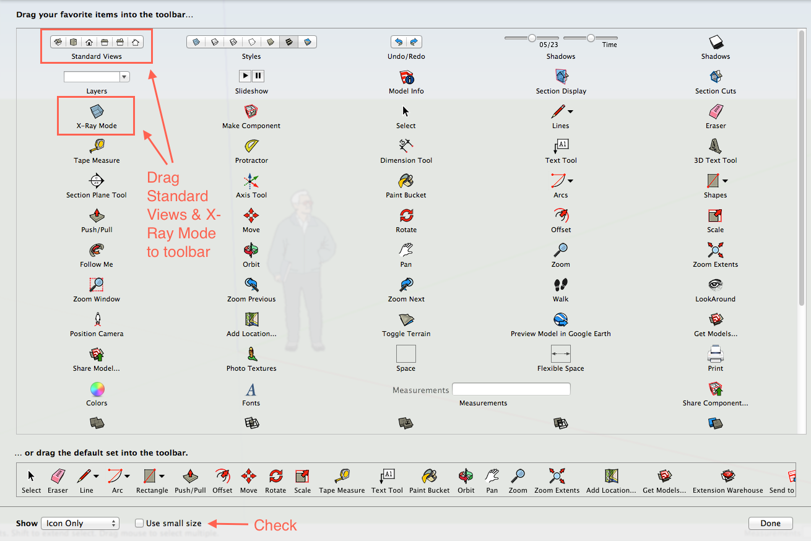
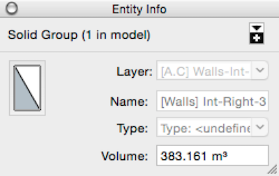

_Follow the **bolded** text to find essential information. To download this guide as a .pdf, go to File > Download as > PDF Document. (Note that internal links may not work outside of Google Docs.)_

**_This tutorial introduces techniques for using SketchUp Pro 2018.  The free version of SketchUp is now an [online tool](https://app.sketchup.com/app).  Download information for SketchUp is available at [this URL.](https://help.sketchup.com/en/sketchup/downloading-sketchup)   This tutorial introduces the OS X interface for SketchUp Pro; the Windows interface may differ slightly._**

## What is SketchUp, and why do we use it?

**[SketchUp](https://www.sketchup.com/) is a 3D modeling tool that is available in both free ([online](https://app.sketchup.com/app)) and paid (SketchUp Pro) versions for Mac and PC.  **SketchUp Pro is available [free for faculty](https://www.sketchup.com/3Dfor/education-educators).   In the Wired! Lab, we use SketchUp to teach fundamentals of 3D modeling for the purpose of modeling historic objects and architecture.  We find that students who create 3D historic models gain valuable knowledge about how objects were constructed and used that they can then use to make important arguments about objects' histories and uses. Such experiences can yield understandings of art and architectural history that students are less likely to gain from simply studying primary and secondary sources.

While many will eventually turn to other 3D authoring software like [Blender](https://www.blender.org/), Autodesk [3D Studio Max](https://www.autodesk.com/products/3ds-max/overview), or [Autodesk Maya](https://www.autodesk.com/products/maya/overview) because of their native photorealistic rendering and other capabilities, SketchUp remains a robust solution for mesh-based modeling and often can accomplish quite sophisticated modeling tasks. 

Basic Concepts of 3D Modeling in SketchUp

**Locate SketchUp in your Applications folder, and open it. In the start up window that appears, click "Start using SketchUp". As you read this section, examine the SketchUp workspace. **

### 3D Space

**SketchUp creates a virtual space in which users can model in three dimensions. This virtual space is defined by three axes (X, Y, Z). **You may remember from Geometry that when graphing or modeling in two dimensions we use what is known as the **[Cartesian coordinate system](https://en.wikipedia.org/wiki/Cartesian_coordinate_system) (X-Y axes)** to define specific points and areas in two dimensional space. This system helps us to express the location of a point or the location and size of an object, as well as a point or object's spatial relationship to another point or object. **We use this same system for modeling in three dimensions but with the addition of a third axis: the Z axis. In SketchUp,** **the X and Y axes form the ground plane (a gray or green area), from which modelers build up into 3D space.** **The Z axis stands perpendicular to the ground plane defining the third, or upward, dimension. The point at which the three axes meet is the "origin". **

**Users can tell the three axes apart based on each axis' color:**

**X** = Red | **Y** = Green | **Z** = Blue

**Knowing which axis is which is key to knowing where your model is located in 3D space and the angle from which you are viewing it. **

Note that** the axes are shown as both solid and dotted lines. The solid axis lines denote the edges of the 3D space in which you want to create your model. The origin marks the front left corner (from the modeler's perspective). **The dotted lines show continuations of the axes outside of the working space to aid the modeler in understanding where she is working in the virtual space.

### Parts of a 3D Object

SketchUp uses a **mesh-based** modeling paradigm.   This means that **models** created in SketchUp **are composed of points, lines, and faces**.   In many other mesh-based modeling applications, a point is called a **vertex** (plural: _vertices_) and a line is called an **edge**.

In addition, unlike many other 3D modeling applications, in SketchUp, **faces are _two-sided_**. The front, or **normal side**, appears as white, while the back-face, the **non-normal side**, is gray in SketchUp.  **Normal faces must always face outward in a model, whether representing the exterior or interior of an object. _This is particularly important to understand later when adding color or texture (such as brick, wood paneling, or roofing) to an object. The non-normal side of a face will not show colors or textures._** In addition, if you hope to export a model into another 3D modeling program (such as 3D Studio Max), non-normal sides will appear to be invisible, which may give you the impression that your model has holes in it.

**In SketchUp 3D objects are generally created by drawing a 2D closed shape and extruding, or pulling, the 2D face up into 3D space.**

## Interface

SketchUp has **three main areas within its interface:** **the editing window**, or virtual space in which models are created, **a customizable** **toolbar** above the editing window, and a bar beneath the editing window that includes **a Measurements entry box and an abbreviated Help window** that describes how users may use a selected tool. Additional windows and toolbars can be added and will be discussed later in this guide.

### Toolbar

The toolbar above the editing window contains the basic tools needed to move around the editing window's 3D space and to create and edit objects. 

 

** All SketchUp tools have been listed with their icons and labels on this **Quick Reference Card** ([Mac](http://dl.trimble.com/sketchup/2018/en/sketchup2018refcardmac.pdf) / [PC](http://dl.trimble.com/sketchup/2018/en/sketchup2018refcardwin.pdf)). 

Many of these tools also have shortcut keys that help users move between tools quickly. **Essential shortcut keys include:**

| Controlling Point of View | Selecting / Moving an Object | Creating/Modifying an Object |
|---|---|---|
| Orbit tool = o | Select tool = spacebar | Rectangle tool = r |
| Pan tool = h | Move tool = m | Line tool = l |
| Zoom tool = z | Rotate tool = q | Circle tool = c |
| Zoom-Extents tool = shift-z  |   | Push/Pull tool = p  |
| | | Erase tool = e |
| | | Scale tool = s |

**_A complete list of shortcut keys can be viewed and modified by navigating in the top SketchUp menu to SketchUp > Preferences > Shortcuts._**

## Configuring Your Workspace

** Please follow these instructions to set up your workspace if you are working in SketchUp for the first time, or if this is the first time you have opened SketchUp on the computer you are currently using. **Once you have completed these once, SketchUp will remember your settings.

### Instructor

To aid new users, SketchUp offers an "Instructor", an extra context-sensitive window that provides tips on how to use a tool when it is selected. **We recommend that new users work with the Instructor open so that they can easily find how-to information as they work. To turn on the Instructor if you do not already see it to the side of your main editing window, navigate to Window > Instructor.**

### Customizing your Preferences

1.  Navigate to **_SketchUp > Preferences_**.
2.  _Optional:_ On the left of the window that appears, select the **Applications tab**, and set your image editing application to your preferred image editing software.
3.  _Optional:_ Select the **Compatibility tab**. Only modify these settings if you find the default behaviour of SketchUp's navigation is non-intuitive. 
4.  Select the **General tab**. Make sure "Auto-save" is checked, and set the interval to "Every 5 minutes". As you work, SketchUp will maintain a back-up copy of your model (you'll see it in Finder as a duplicate file with a ~ added to the file name), which you can use to recover your work in case of human or technical errors.
5.  Select the **OpenGL tab** and check "Use maximum texture size". A warning message will appear. Click "Yes" to continue. Adding this option allows you to create the highest quality models possible in SketchUp.   

    !!! caution
        Do not enable maximum texture size on older computers or those without a powerful GPU (graphics processing unit, aka "graphics card").  Application performance may be significantly slowed and/or degraded. 

        
6.  Select the **Workspace tab**, and make sure that "Use large tool buttons" is checked.
7.  Select the **Template tab**, and highlight "Architectural Design - Millimeters". This will set your model's units to millimeters. **This step and the follow step are important for ensuring that you know which units of measure you are modeling in and that your model is created to the correct scale.**
8.  Close the Preferences dialogue box, and close your current editing window. **Navigate to _File > New_ **to open a new window to create a file using the units of measure you set above.

### Customizing your Toolbar

1.  Navigate to **_View > Tool Palettes > Large Tool Set_** to show an additional window of [useful tools](images/007largetools.png).
2.  Select **_View > Customize Toolbar_** to open a menu of other tools you can add to the top toolbar.
3.  **Click and drag the Standard Views and X-Ray Mode icons to the toolbar.** Then **check "Use small size"** to make icons fit better into the toolbar. Click "Done" to close this window.   
    

    1. **Standard Views** will help you view your model from different preset points of view (from left to right):

        * ISO (perspective)  
        * Top
        * Front
        * Left
        * Right
        * Back
    
    2. **X-Ray mode** will make your model semi-transparent, which can be useful to toggle on and off when you are working with complicated models whose geometries overlap one another.

### Setting up your Mouse

**It is helpful to work with a 3 button (PC) mouse whenever you are 3D modeling. **The secondary button and scroll wheel can make modeling a smoother process. **If you are using a Mac mouse or trackpad**, **you may need to turn on secondary mouse features. **Follow these steps to activate the secondary mouse button if it is not already turned on:

 

1.  **Navigate to the Apple menu in the top left of your computer window. Select "System Preferences". **
2.  For a Mac mouse:
    1.  In System Preferences, **locate and select the mouse menu** (pictured at right). 
    2.  In the dropdown menu for the right mouse button, make sure that "Secondary Button" is selected (as shown below).   
    
3.  For a Mac trackpad: 
    1.  In System Preferences, **locate and select the trackpad menu** (pictured at right).
    2.  Check the box next to "Secondary Click", and make sure "Click or tap with two fingers" is selected below.

        

As you work with SketchUp, you will develop your own workflows. You can then return to "Preferences" adjust settings and to the "Customize Toolbar" menu to add other tools to your toolbar as you see fit.

## Beginner Modeling Tools

**Take some time to experiment with the tools in SketchUp to create some simple 3D shapes. Try to complete each of the following tasks:**

### Practice navigating

1.  From the top or left toolbar, select the **Pan** tool (keyboard shortcut: h).  Click and drag to move your view up, down, and side to side.

2.  Select the **Orbit** tool (o). Then click and drag to change your 3D point of view. Note that you can orbit in any direction. 

3.  Select the **Zoom** tool (z). Click and drag to change your zoom level to look at the figure standing near the origin from far away or at close range. Also try using your scroll wheel to zoom in and out.

4.  To reset your point of view, **press Command + 7** or click the ISO perspective view button (shown right) from the Standard Views. If needed, use your scroll wheel to zoom out so that you can see all of the figure.
  
### Select and move an object

1.  Click the **Select** tool (spacebar). Click on the figure to see it highlighted in blue. Any time an object is highlighted in blue, it is selected.

2.  Click the **Move** tool (m), and click and drag the figure around the space. Note that you can use the move tool to select objects. 

3.  To return the figure to its original position, navigate to _Edit > Undo_ or press Command + z. 

4.  Click the **Rotate** tool (q). Note that you can **use the rotate tool to rotate on multiple axes.** Click once on the figure (the rotate tool will be outlined in black). Move your mouse away from the figure and click again. Now drag your mouse to see the figure rotate around the first point you selected on the figure's geometric face. Click a third time to set your figure's location. Select _Edit > Undo_ (Command + z) to reset your figure's position. To rotate on the **X**, **Y**, or **Z** axes:
&nbsp;

    **X** axis: Select a side view (Command + 5)  from the Standard Views. Your view will be reoriented so that the **Y** axis crosses the screen and the **X** axis appears to be moving away from you. Note that now the rotate tool is **red**. With the figure selected, click once on the origin. Then click on another point slightly farther away from the origin. Now drag your mouse to see the figure rotate _around _the **X** axis. Click to set your figure's location. (If you wish, use Undo to reset your figure's location.)
&nbsp;

    **Y axis**: Return to the front view (Command + 3)  in Standard Views. Note that the rotate tool is now **green**. With the figure selected, click on the origin. Then click on another point slightly farther away from the origin. Now drag your mouse to see the figure rotate _around_ the **Y** axis. (If you wish, use Undo to reset your figure's location.)
&nbsp;

    **Z** axis: Select the top view (Command + 1)  from Standard Views. The **Z** axis should now appear to be coming toward you as you look down on the figure. Note that the rotate tool is now **blue**. With the figure selected, click on the origin. Then click on another point slightly farther away from the origin. Now drag your mouse to see the figure rotate _around _the **Z** axis. (If you wish, use Undo to reset your figure's location.)

5.  **Return to an ISO (perspective) view** in Standard Views (Command + 7). 

6. Click the **Zoom extents** tool (Shift + z) if you need to locate your figure. Use your scroll wheel or the zoom tool to zoom out until you can see both the figure and the origin. 

7.  With your figure selected, choose the **Scale **tool (s) from the toolbar. The figure's outline should turn yellow, and you should see green transform buttons on its edges and corners. Hover your mouse over a green transform button. It will turn red. Click on it, and drag your mouse to see the figure change size. Try on a corner and on a side.

8.  When you have finished with the scale tool, **select your figure and press the delete key** to remove it from your scene.
     
### Draw 2D Shapes

There are numerous ways to begin drawing in SketchUp. Almost all of them begin with the creation of 2D shapes that are later converted into 3D shapes. **Here are some of the tools you can use to draw in two dimensions. Change your view to a standard top view before you begin. **

1.  **Select the Line tool (l)**. Click once on the origin to set the first point. Then move your mouse and click somewhere else. Continue to make series of connected segments. Note that if you return to the first point you created after creating at least two line segments and click on it, a face appears. You have created a closed polygon. Press Command + Z multiple times until you have removed all line segments to clear your editing space.

2.  **Select the Rectangle tool (r)**. Click once on the origin to set the first point. Move your mouse away from this point, and click to set the diagonal. You have just created a rectangle. Press Command + Z to clear your editing space.

3.  In the top menu, **click the drop down button on the Rectangle tool** to reveal several other tools for drawing regular 2D shapes: rotated rectangle, circle, and polygon. **Select the Polygon tool.** **Before you click**, notice the text box in the bottom right corner of your editing window.  It should now be labeled "Sides" and show the number 6.   

    
    
    The Polygon tool is set by default to draw a hexagon, but if you press one or more different number keys and press Enter, you can change the tool to draw a different number sided shape such as a triangle or octagon. **Enter a number other than 6 to set your polygon's number of sides. Click your mouse once on the origin to set your polygon's center; then move your mouse away from the center, and click again to set the size of your polygon**. Press Command + Z to clear your editing space.

4.  **Select the Circle tool (c)** either by selecting it from the Rectangle drop down menu (shown above) or by pressing the c key. The "Sides" text box should now show the number 24. **Note that SketchUp draws only polygonal shapes--even circles are simply many-sided polygons**. If you wish to have a circle appear to be as smooth as possible, you can increase the number of sides. However, 24 is usually sufficient. Click once on the origin to set your circle's center. Then move your mouse away from the origin, and click again to create the circle. If you zoom in (z) a bit, you should be able to see the sides of the "circle". **Keep your circle for use in the next step.**

5.  It is possible to draw polygons within polygons. This can be useful for drawing walls on a floor plan, for example. Let's say you want to create a set of concentric circles. **Select the Offset tool** **(f)**. **Hover your mouse over the edge of your circle. Click once to identify that you want to create an offset polygon based on this shape. Move your mouse away from the circle and click to create a larger circle surrounding your original circle. Select the original circle's edge again, and move your mouse toward the center to click and create a smaller concentric circle.** Note that once you create one larger/smaller concentric circle, you can create progressively larger, equally spaced circles by double clicking on the new circle's edge. 

6. **Press the spacebar to activate the Select tool.** Hover your mouse over the original circle and then over the offset circle. **Note that the offset's face does not overlap with the original circle's.** They are two separate polygons even though they appear to connect. **Click and drag with the Select tool to select all shapes you have created, and press the delete key to clear your editing space.**

### Draw 3D Shapes

In SketchUp, we create 3D shapes by extruding from a 2D shape. Note that **3D shapes are often referred to in 3D modeling as "meshes".**

In the steps below, create a 3D box shape from a 2D rectangle.

1. **Draw a 2D rectangle.** 

2.  Rotate your camera to an ISO (perspectival) view (Command + 7). 

3.  **Select the Push/Pull tool (p).** Hover your mouse over your polygon's face. Click once and move your mouse up and away from the polygon's face. A 3D shape will begin to appear. **Release your mouse to finish creating the shape.** Note that you can now modify the volume of your new 3D shape by using the Push/Pull tool to move one of its faces. 

2.  **Rotate your view to a standard front view **(Command + 3).** Select the Rectangle tool (r) again, and** **draw a new, large 2D rectangle onto the front face of your polygon mesh**. **Rotate your camera view just slightly to the right or left**. 

3. **Select the Push/Pull tool (p), and hover over your new 2D polygon to select it. Click and drag your mouse to move the face away from you slowly until your mouse appears to snap to the opposite face.** You may receive a popup notice telling you that your cursor is "On face", or that your "Offset limit" is set to a certain measurement. **Release your mouse button to create a hole through your 3D shape. Orbit around the object to check that you have indeed create a whole. If you see a new polygon mesh protruding from the original rectangle, Command + Z back to the 2D rectangle and try again.** This method for creating holes, often used for creating doors and windows, can take some practice. Don't worry if you have to try it a few times before you successfully create a hole.

### Take Measurements & Draw to Scale

So far, we have not addressed issues of scale. **_It is important that you create your models to scale. Generally, we teach 1:1 (life-size) modeling. _**To do this, you need to know the measurements of the object your are modeling, and you need to be able to verify that your model's measurements match those of the real object as you are creating the model.

1.  To check a model's measurements, **select the Tape Measure tool (t). Click on a corner (highlighted in green when you hover) of your 3D rectangle. Move your mouse to another point, and click. **A measurement in millimeters (mm) should appear in the text box (now labeled "Length") in the lower right corner of your editing window. Note that SketchUp can show only one measurement at a time, so you may wish to record your measurements in a notes document as you are working if you need to refer back to multiple measurements.

2.  **Clear your editing space, and make sure you are in a perspectival view.**

3.  **Let's say you want to create a building that is 2 meters wide, 3 meters deep, and 4 meters high.** You'll need to begin by creating a 2x3m rectangle. Select the Rectangle tool (r), and click once to set a corner at the origin. Move your mouse away to the top right of the origin. **Before you click to set your rectangle, notice the text box in the bottom right corner of your editing window is labeled "Dimensions" and has a set of measurements listed** (for example, "650mm, 600mm"). Remembering that there are 1000 millimeters in 1 meter, **let's enter the correct dimensions** for the rectangle we are creating: "3000, 2000". **Press Enter** to see your correctly scaled rectangle appear. You have just created the ground plan for the building and the edge for the building's exterior walls.
&nbsp;

4.  Keeping in mind that our building, made out of brick, needs to have 3D walls, let's now use the Offset tool (f) to create 90mm-thick interior walls. With the Offset tool (f) selected, click on the rectangle's face and begin to move your mouse to the center of the rectangle. **Before you click** **to set the interior walls**, key in 90 and press Enter. You should now have a smaller offset rectangle within the larger rectangle. This smaller rectangle forms the edges of the interior walls. 
&nbsp;

5.  Now **select the Push/Pull tool (p)**. Click once on the surface _between the interior and exterior wall edges_ and begin moving your mouse up. **Before you click to set the mesh's height**, type the correct dimension for the height, "4000", and press Enter. Orbit and pan around your editing window to view your new to-scale 3D mesh. If you wish, use the Tape Measure tool (t) to check your work.
&nbsp;

6.  **Sometimes it can be helpful when creating a to-scale model to use construction guides to help you draw to the correct dimensions.** You can create these on any plane using the tape measure tool. **Let's say you want to draw a door on your new 3D building that you've just created**. You want the door to be centered in the front (3m) face of your building. A guide can help you to draw this door:
    
    1.  Rotate your camera to a front view (Command + 3).
    
    2.  Select the Tape Measure tool (t). Click once on the left edge of the face. Now move your mouse down to the bottom edge of the face and move it along until a light blue point appears. This is the face's midpoint. Click to create a vertical dotted line that appears to divide this face into two 1.5m sections. This is your first construction guide. _It is not part of your model._ 
    
    3.  Let's say your door needs to be 0.9m wide and 2m high. If we can identify one of the vertical edges of the door using the construction guide we created, then we should be able to draw the outline of the door. Half of 0.9m is 0.45m, or 450mm. We need to create a guide that is 0.45m away from our first construction guide.
&nbsp;

    
    4. Rotate your view so that you have a standard front view of your model. With the Tape Measure tool (t), click once on our first construction guide (a red square should appear when you hover your mouse over it). Then move your mouse to the left of the construction guide, press "450" and Enter to set a new construction guide for the left edge of the door.
&nbsp;

    
    5.  Now select the rectangle tool and use the new (left) construction guide's intersection point with the bottom edge of the building's front face to draw your door (a red x should appear when you hover). Remember to key in the dimensions (in millimeters) to set the door's outline to the correct scale. Note that the first dimension is always width, and the second dimension is always height. 
    
    6.  With the Select tool (spacebar), you can now select and delete your construction guides. 
    
    7.  Use the Push/Pull tool (p) to create the door's opening.   

        

These tools are only some of those available to you. To practice using these and other tools in a sample project, check out the Wired! Lab's [Pavilion](http://bit.ly/web-skp-pavilion) and [Portal](http://bit.ly/web-skp-portal) tutorials.

The next sections describe a [recommended workflow](#recommended-workflow) for modeling in SketchUp,[ tips for modeling](#beginner-modeling-tips), [organizing models](#organizing-your-model), and [cleaning models](#cleaning-your-model). **Please read these next sections carefully as they contain important information that will save you time, and possibly frustration, later.**

## Recommended Workflow

**The recommended workflow for creating any model in SketchUp is to**

1.  **Draw a two-dimensional shape** [in Layer 0](#organizing-your-model). (See the following section on [Organizing your Model](#organizing-your-model) for more on Layers.)
1.  Note that you can **set the dimensions of your shape **by entering the desired measurements in the text box in the lower right hand corner of the window. (The Measurements box, which is labeled "Dimensions" when users select a drawing tool.)
1.  **Extrude the shape so that it becomes three-dimensional, setting the dimensions in the measurements text box.**
    1.  The Measurements box will now be labeled "Distance"-- this will be the distance of the original face from the face that is now opposite it (above it) as you extrude the object (up). You can also set these by typing in the desired measurements. Note that if you extrude a face that has previously been extruded, the distance measurement will reflect the distance between the face's previous 3D position and the new position you are giving it. Sometimes, the distance will appear as a negative number.
1.  **Add another object to this first object by drawing a two-dimensional shape on one of the first object's surfaces.** Then extrude to make the shape three-dimensional. _This can be done to model either additively (adding surface area to the overall model) or subtractively (taking surface area away by extruding into the first object)._
1.  **[Remove any extra faces or lines](#cleaning-your-model) used to create an object that are no longer needed.** Make sure all faces are oriented in the correct direction. Make sure your object is "water tight" -- that there are no holes in the geometry unless you intend there to be.
1.  **Create [a Group](#organizing-your-model) for your geometry, and add it to the appropriate Layer**--if needed, make a new layer.  Use groups and layers to keep your objects, or distinct parts of your architecture, organized. See the following section on [Organizing your Model](#organizing-your-model).
1.  **Continue creating each part of your model in Layer 0, [cleaning it](#cleaning-your-model), grouping it, and adding it to the correct Layer. **You will need to return to Layer 0 each time you are ready to create a new part of your model.

## Beginner Modeling Tips

1.  **Before you begin creating a 3D model**:
    1.  Gather as many primary and/or secondary sources about the building as you can.
    1.  Know the scale--in which scale of measure is the building drawn? Will you need to make any conversions from historical units to metric or imperial/American units?
    1.  Identify multiple discrete sections of your model. (Roof, facade, walls, floor, etc.) Plan to model each section individually either in one SketchUp file or in separate files, bringing the parts toghether in one file later. (If you choose the latter, be very careful to ensure that you are working in the correct scale for all files.)
1.  **Save often, and save multiple versions.** It's a good idea to create a new version of your model's file each time you begin to make major changes. Although you can use Edit > Undo in SketchUp, this function may not save all of the changes you make as you try out different techniques for modeling. It's always good to have a clean earlier version of your model to return to if you need to. Likewise, if you are trying out different options for ways to model a particular feature, save these in separate files so that you can compare them to one another before making a decision about which method you plan to use for the final model.
1.  **Make sure you know where you are**. It is easy to get disoriented in three-dimensional space, but if you do not know where you are or from which point of view you are looking at an object you may find yourself creating objects incorrectly oriented. For that reason, **always begin modeling from the origin.** This will help you know where you are in three-dimensional space as you build your model.
1.  **Create your model in sections using [Groups](#creating-groups) and [Layers](#creating-layers)**. This may require some pre-planning on your part. Using the sources you have, break your model down into discrete pieces that can be modeled separately. It may also be important to plan the order in which you model the sections. Then create a list of Groups and Layers you believe you will need based on these pieces. Create your Groups and Layers as you work.
1.  As you create new geometries, pause to **think about how you are going to compose the geometries so that you have points, lines, and faces in all the right places. **Most importantly, make sure you know where all of your points, lines, and faces are going to be and whether they are going to facing the right direction (lighter side out). 
1.  **Take the time to clean up your model as you work.** Sometimes you will need to create extra geometry to build new features. Remove excess points, lines, and faces as you work.

## Organizing your Model

The easiest way to create an organized model is to **be organized from the beginning: use Groups & Layers extensively. Geometries can be assigned to a Layer. Layers are used to show and hide selected geometries. Groups are points, lines, and faces that have been grouped together under one name. **Grouping a set of points, lines, and faces makes it possible to modify all objects within the Group at the same time in the same way. 

### Creating Groups

** Groups are points, lines, and faces that have been collected together under one name. **

1.  Make sure you have the Layers, Outliner, and Entity Info windows open by checking each in the top Window menu.

2.  After you have created the geometry you wish to group, **use the select to select all of the points, edges, and faces you wish to group**. (Examples of correctly grouped geometry might be a window, a door, a staircase, etc.)

3.  **Press Command + G**, or right-click and select "Make Group" from the menu. A blue box should appear around your new Group.

4.  In the Entity Info window, **name your Group** (in SketchUp 2018 this field is called "Instance") in such a way that you will immediately be able to identify the grouped object just from its name. In other words, refrain from calling a group "Group 1" or "Door" if you know that you will have multiple Groups or multiple doors. It is better to be explicit: for example, consider labeling front and back doors "Front Door" and "Back Door".

    

5.  **Select the appropriate Layer for the Group.** If possible, Groups should be kept in Layers other than Layer 0.** **(If you need to create a new Layer, see next section on [Creating Layers](#creating-layers).)

6.  **View your Group in the Outliner window. **Here you can select multiple Groups, reorder them, and gather multiple Groups together using super- and subgroups.

    1.  For example, you might create a window. You group all geometry for that window together, name the group based on the window's placement on a wall, and add the window to a Group named Windows. 
    
    2. You then copy this window and make new windows, placing them elsewhere on the model. Each time you paste in a new window, you give it a slightly different name--one that helps you identify it as being in its own separate Group from the other windows. You finish adding windows to one wall of your building. 
    
    3. You select all of these windows and place them into a larger supergroup of all windows on that wall, naming the group so that you can immediately identify the wall where these windows are placed. Each individual window remains in its own subgroup, but all of these windows also belong to a unifying supergroup. 

### Creating Layers

**Layers are used to show and hide selected geometries and/or Groups of geometries.** As you build a model, being able to show and hide particular parts of your model can be useful for visibility and organization. 

1.  In the Layers window, note that **there is by default a Layer 0. This is the Layer in which you want to draw geometries before you group them and add them to their own Layers. **

2.  **Each time you create a new Group, you need to add it to a Layer** either by creating a new layer or adding it to an existing Layer.

3.  **To create a Layer**, click on the + symbol in the Layers window. A new Layer will appear in the Layers list. Give it a name that makes its contents immediately identifiable. (For example, name a Layer of windows "Windows". Refrain from naming Layers using a number system such as "Layer 1".)

4.  **Note that you can make Layers visible or invisible by checking or unchecking boxes in the Visible column of the Layers window. **You can use colors to categorize Layers if you wish in the colors column. The radio button in the column left of the Layer names indicates which layer you are currently working in. 

    _Make sure you have Layer 0's radio button selected for making new geometries, and make sure you are working in the correct layer when modifying geometries. You cannot make invisible the Layer in which you are currently working. You must first move the "current layer" radio button to another layer._

## Cleaning your Model

Now your model is organized, but **is it clean? **Having a clean model, one without extraneous or incorrect geometries, is extremely important if you wish to present a scholarly model. Scholarly models are well-formed. They support the scholar's argument, and they do not provide room for doubt or distraction. **To make sure your model is clean, **check the following:

1.  **Are all of your faces oriented in the correct direction?** If an object is showing a face normal (white) then the face is oriented correctly; if it is showing a gray face then it is not oriented correctly. _Checking this is especially important if you plan to add color or texture to your model and/or to import it into other 3D modeling and virtual reality or gaming software_. 

2.  **Do you have any extraneous geometry?** If so, carefully erase them making sure not to remove important parts of your model.

3.  If you plan to add the current model to other models created in other files, **is your model in the right scale?**

4.  **Are there any missing faces?** Be sure that each piece of geometry has all its faces and those faces' surrounding edges.

5.  **Do your Groups and Layers contain the correct geometry?** Are the Groups and Layers named explicitly?

6.  **Save** this final version of your model as a native .skp file. Then create a new version if you plan to add textures or export your model to another software so that you can return to this version is something does not work.

**If you _do _need to refine your models after most of your geometry is built, try to following method:**

1.  **Make sure you have Layers for each main element of your model.** Try to limit these in number and level of detail (no more than 8 Layers). For example: floor, apse, ceiling, roof, facade, walls. Make sure you keep Layer 0 for drafting purposes.

2.  **Make sure all but one Layer has been made invisible. **

3.  **Select any geometry that still appears that is conceptually unrelated to your visible layer.** Move it to Layer 0; or if you know where it should be move it to its correct Layer. 

4.  **Repeat steps 2-3 for all Layers until all geometry is in the correct Layer(s).**

5.  Clean your Groups.

    1.  **Write down the Groups hierarchy you wish to make**. Doing this now will help you maintain consistency in naming and grouping later.
    
    2.  **Turn all but one Layer off.**
    
    3.  **Go through each Group in this Layer one at a time to make sure they contain the correct geometries.** If they are missing geometries, add them. If a Group contains geometries that are not part of that Group's overall concept, remove them. In order to do this, you will need to explode Groups and recreate new groups. **To explode a Group**, select the Group, right click and select "Explode". This action will remove the Group.
    
    4.  **Remember, you can create Groups within Groups.** For example, a Group might be a Facade. Then within Facade, you might have a Group called Facade-Windows. You might even have Groups within Facade-Windows for each individual window. (If you do this, make sure you name the Groups so that you know which object belongs to which Group.)

6.  **Repeat step 5 for all Layers.**

7.  **Return to Layer 0. **Are there still sections of geometry that have not been group or placed in the appropriate Layer? Carefully place all remaining geometry in their correct Group(s) and Layer(s).

## Resources

_SketchUp.com:_ [http://www.sketchup.com/learn](http://www.sketchup.com/learn)

_SketchUcation:_ [http://sketchucation.com/](http://sketchucation.com/) (free sign-up required)

_Wired! Online Tutorials:_ [ http://www.dukewired.org/workshops/#tab-id-2](http://www.dukewired.org/workshops/#tab-id-2)

Remember, **search engines and video tutorials are your friends**. They can help you find numerous how-to videos and discussion forums that provide answers to specific questions or problems.

**Have questions about this tutorial or your project? Contact Hannah Jacobs at [hannah.jacobs@duke.edu](mailto:hannah.jacobs@duke.edu).**