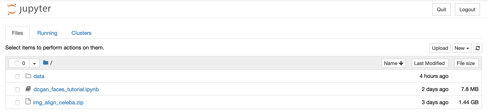

This document outlines how to implement the [PyTorch DCGAN faces tutorial](https://pytorch.org/tutorials/beginner/dcgan_faces_tutorial.html) on the [Duke Compute Cluster (DCC)](https://rc.duke.edu/the-duke-compute-cluster/).   It assumes you already have GPU access to the DCC (through, for example, the [Duke AI for Art Competition](https://plus.datascience.duke.edu/announcements/duke-ai-art-competition)).  

More generally, it outlines how to instantiate and launch a [Jupyter Notebook environment](https://jupyter.org/) on a DCC GPU module.

## Part I:  Test Connection to the DCC

1. Open Terminal.

2. At the prompt, type the following (replacing `netID` with your own Duke NetID):

    ```
    ssh netID@dcc-slogin.oit.duke.edu
    ```

    When prompted, type your Duke shibboleth netID password.

3. If successful, you will be authenticated to one of three "front-end" machines that serve as a gateway to the DCC:

    * dcc-slogin-01.oit.duke.edu
    * dcc-slogin-02.oit.duke.edu
    * dcc-slogin-03.oit.duke.edu

4.  Type `exit` at the prompt to disconnect from the DCC.


## Part II:  Download Training Data / SFTP to DCC

The PyTorch tutorial makes use of the [Large-scale CelebFaces Attributes (CelebA) Dataset](http://mmlab.ie.cuhk.edu.hk/projects/CelebA.html).  It consists of 202,599 images of celebrity faces.   This dataset of images will be used to train the GAN so that it can generate a fake set of images.   Additionally, PyTorch has made available all of the code from its tutorial as a Jupyter Notebook file.

1.  At the time of this writing, the CelebA dataset is available on Google Drive.  Download the [~1.3 GB CelebA zip file](https://drive.google.com/uc?id=0B7EVK8r0v71pZjFTYXZWM3FlRnM&export=download) to your computer's harddrive (local machine).

1. Download the [DCGAN Jupyter Notebook](https://pytorch.org/tutorials/_downloads/e9c8374ecc202120dc94db26bf08a00f/dcgan_faces_tutorial.ipynb) to your local machine.

1. In Terminal, type the following to open an SFTP (secure file transfer protocol) connection to the DCC:

    ```
    sftp netID@dcc-slogin.oit.duke.edu
    ```

    You will be prompted to provide your Duke shibboleth netID password.

    !!! attention "Important" 
        If you are connecting from off-campus, you must first run the [Duke VPN](https://oit.duke.edu/what-we-do/services/vpn)

1.  Upon successful connection, you will be presented with the following prompt:

    ```
    sftp>
    ```

1.  To push the Jupyter Notebook file to the DCC, type the following at the `sftp>` prompt:

    ```
    put /path/to/dcgan_faces_tutorial.ipynb
    ```

    !!! tip
        You can drag and drop the file into Terminal after typing `put ` to auto-enter the full path.
    
1. To push the CelebA Faces dataset to the DCC, type the following at the `sftp>` prompt:

    ```
    put path/to/img_align_celeba.zip
    ```

    Uploading this large file may take several minutes.

1.  When the file transfer is complete, type `exit` at the `sftp>` prompt to close the SFTP connection to the DCC.

## Part III:  Unzipping the Training Data

1.  In terminal, open an SSH connection to the DCC, entering your password when prompted:

    ```
    ssh netID@dcc-slogin.oit.duke.edu
    ```
    
1.  Confirm that the files you uploaded in part II exist on the server.  At the prompt, type:

    ```
    ls -hs
    ```

    The output should be:

    ```
    total 1.7G
    -rw-r--r--. 1 netID grp 7.5M Date time dcgan_faces_tutorial.ipynb
    -rw-r--r--. 1 netID grp 1.4G Date time img_align_celeba.zip
    ```

1.  The [PyTorch DCGAN tutorial](https://pytorch.org/tutorials/beginner/dcgan_faces_tutorial.html#inputs) suggests that the dataset should be unzipped into a data root of `data/celeba`.   Create these directories with the following command:

    ```
    mkdir -p data/celeba
    ```

1.  Finally, unzip the CelabA Faces dataset:

    ```
    unzip img_align_celeba.zip -d data/celeba
    ```
    The progress of the unzip action will unfold in the Terminal.  This may take several minutes to complete.  Remember, the zip file contains over 200,000 images!

## Invoke Jupyter Notebook

This section of the tutorial explains how to invoke a Jupyter Notebook server in the DCC GPU environment and access it with your web browser.

If you're working through this tutorial from start to finish, you're already logged into the DCC.  If not, launch Terminal and enter `ssh netID@dcc-slogin.oit.duke.edu`

1.  Note that when you log into the DCC you're passed off to one of three machines:

    * dcc-slogin-01.oit.duke.edu
    * dcc-slogin-02.oit.duke.edu
    * dcc-slogin-03.oit.duke.edu

    The machine you're authenticated to will be indicated at the Terminal prompt.  In the example below, the user is logged into cc-slogin-02.oit.duke.edu:

    ```
    netID@dcc-slogin-02  ~ $
    ```

1.  Next you'll want to invoke the GPU environment with the following command:

    ```
    srun -p artai-gpu --account=artai --gres=gpu:1 -c 10 --mem=10G --pty bash -i
    ```

    This command invokes an interactive [SLURM](http://schedmd.com/slurmdocs) session with the command `srun` on the "artai-gpu" partition (created for participants in the [Duke AI for Art Competition](https://plus.datascience.duke.edu/announcements/duke-ai-art-competition)), reserving 1 gpu (`--gres=gpu:1`), 10 CPU cores per process (`-c 10`) and 10G memory (`--mem=10G`).  It then opens an interactive bash session in that environment (`--pty bash -i`).

1.  The SLURM workload manager will then queue your request for a GPU and then wait for available resources.  

    ```
    srun: job 46023771 queued and waiting for resources
    ```

1.  Successful allocation will be indicated:

    ```
    srun: job 46023771 has been allocated resources
    ```

    and the Terminal prompt will indicate which GPU node you are allocated:

    ```
    netID@dcc-dsplus-gpu-02 ~ $
    ```

1.  Load the python-gpu module (virtual environment):

    ```
    module load Python-GPU/3.6.5
    ```

1.  Set the runtime environment for Jupyter:

    ```
    export XDG_RUNTIME_DIR=""
    ```

1.  Set a port number through which you wish to access Jupyter (use a unique set of 5 integers):

    ```
    export myport=48477
    ```

1.  Print out the SSH tunnel information, copying the results of the following command:

    ```
    echo "ssh -NL $myport:$(hostname):$myport $USER@dcc-slogin.oit.duke.edu"
    ```

    Sample results:
    ```
    ssh -NL 48477:dcc-dsplus-gpu-02:48477 netID@dcc-slogin.oit.duke.edu
    ```

1.  Establish an SSH tunnel in a new Terminal session:

    1.  Press `command-t` to open a new tab in Terminal.

    1.  At the new prompt, paste the output you copied in step 8 above.

        ```
        ssh -NL 48477:dcc-dsplus-gpu-02:48477 netID@dcc-slogin.oit.duke.edu
        ```
    
    1. You will be prompted for your password.
    
    1.  Upon password authetnication, it will seem like nothing is happening.

1. Leaving this tab open, return to the first tab (the GPU environment)

1. Launch Jupyter Notbeook server:

    ```
    jupyter-notebook --no-browser --port=$myport --ip='0.0.0.0'
    ```

 1. It may take a few moments for the Jupyter server to initialize.  Once it does, it will indicate a localhost URL with the port you specified and a long token string.  

    Sample output:

    ```
   Copy/paste this URL into your browser when you connect for the first time,
    to login with a token:
        http://dcc-dsplus-gpu-02:45678/?token=6e254b18523a165f7d1dd07e.....
    ```

1.  Copy the URL and paste into your web brower's address bar, but REPLACE `dcc-dsplus-gpu-0X` with `localhost`:

    ```
    http://localhost:45678/?token=6e254b18523a165f7d1dd07e.....
    ```

1.  A web interface to your Jupyter Notebook environment should open in your web browser:

    


## Executing a Jupyter Notebook

To open a Jupyter notebook, simply click on it in the browser window.  By default, it will load in an "untrusted" state.  In this mode, clicking the "Run" button will step through each "cell" of the code, pausing at the next until you again click "Run."

After successfully going through each cell, the next launch of the Notebook will execute the code without user intervention.


