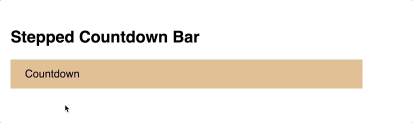
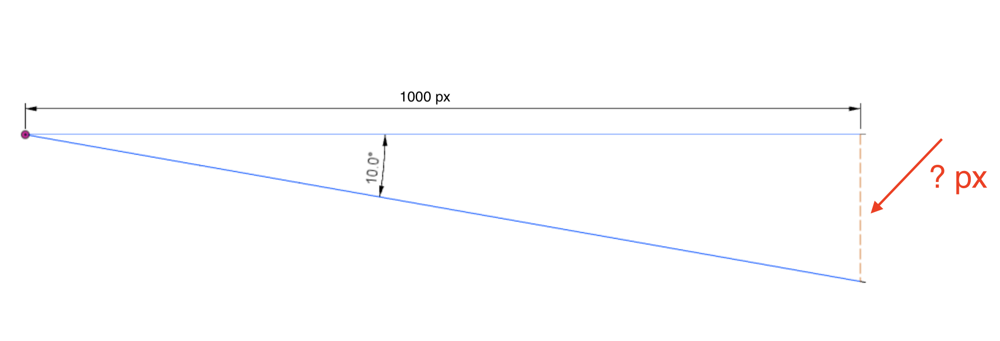

!!! danger ""
    Due:  _**_Second_ Lab Section meeting of the week of October 21<sup>st</sup>**_

## **CSS Animations and HTML5 Media**

### **Overview**

The fifth lab assignment encompasses three goals:

* Use CSS Transitions to animate the width property in a stepwise fashion to create a 5-second "countdown bar" that activates on `:hover`.

* Use CSS Animations to create a looping animation of a beach ball moving down a hill.

* Use the HTML5 `<video>` element to embed an .mp4 video on your page and subtitle it using a [VTT subtitle](http://html5doctor.com/video-subtitling-and-webvtt/) `<track>` element.  

These HTML, CSS, and media files are provided for you as a starting point:  [lab005.zip](lab05.zip)

Download and unzip.  Place the `lab05` folder in the `labs` folder in your local site.

<hr>

### **Requirements for a &#10003;**

Use the following step-by-step to make sure you meet the minimum requirements to earn a **&#10003;** for this assignment.  Scroll down to the [Reach Goals](#reach-goals-for-a) section below for suggestions to extend your work to attain a **&#10003;+**.

1.  Launch Brackets.

1.  Choose File &rarr; Open Folder from the main menu and then locate the unzipped `lab05` folder.

1.  Familiarize yourself with the existing HTML in `index.html`, reproduced here for your convenience:

    ```html
     <!DOCTYPE html>
    <html lang="en">

    <head>
        <meta charset="UTF-8">
        <meta name="viewport" content="width=device-width, initial-scale=1.0">
        <title>Lab 05 - CSS Animations and HTML5 Media</title>
        <link href="./css/lab05.css" rel=stylesheet>
    </head>

    <body>
        <h1>CSS Animations and HTML5 Media</h1>
        <section id="countdown">
            <h2>Stepped Countdown Bar</h2>
            <div class="bar">Countdown</div>
        </section>
        <section id="ball-roll">
            <h2>Rolling Ball Animation</h2>
            <div id="anim-container">
                
            </div>
        </section>
        <section id="media">
            <h2>HTML5 Video</h2>
        </section>
    </body>

    </html>
    ```

1.  Familiarize yourself with the existing CSS in the `css/lab05.css` file, reproduced here for your convience:

    ```css
    body {
        padding: 20px;
        box-sizing: border-box;
        font-family: sans-serif;
        font-size: 24px;
    }

    section {
        /* a little breathing room between sections */
        margin: 100px 0px;
    }

    /* count-down bar */
    .bar {
        width: 750px;
        height: 4rem;
        background-color: #deb887;
        line-height: 4rem;
        padding-left: 2rem;
    }

    /* the "scene" for our rolling ball animation */
    #anim-container {
        width: 1000px;
        height: 400px;
        /* generate a "hill" using CSS linear-gradient */
        background-image: linear-gradient(10deg, #013A6B 50%, #87ceeb 50%);
    }

    /* size and position the beachball before animation */
    .ball {
        width: 100px;
        height: auto;
        position: relative;
        top: 50px;
        left: 10px;
    }
    ```

    <hr>

#### **CSS Transition Countdown Bar**

In this section of the tutorial, you will write the CSS necessary to animate the `<div>` with a class of `bar` to shrink in a step-wise fashion over 5 seconds.  

1.  Find the `.bar` selector in your `css/lab05.css` file.   This CSS defines the "starting" state of the transition.  Note that the `width` property is set to `750px`.

1.  Immediately below the CSS block for the `.bar` selector, create a new block of CSS for `.bar:hover`.   This block will define the "end" state of the transition.  At the end of our transition, we want the countdown bar to be shorter (500px, for example).  Replace the comment in the CSS snippet below with the appropriate code.

    ```css
    .bar:hover {
        /* write your css here for the 'end state' of your transition */
    }
    ```
    
1. Test the non-interpolating (no transition - yet!) animation by mousing over the countdown bar in the browser preview of your lab page.

1. Next we will add to the `.bar` CSS selector block the CSS necessary to interpolate the transition.   Find the `.bar` CSS selector block,and then add the following CSS property declarations _before_ its closing `}`.  

    * `transition-property`
    * `transition-duration`
    * `transition-timing-function`
    * `transition-delay`

    Use `linear` for the `transition-timing-function` and `5s` for the `transition-duration`, for now.  It's up to you to determine what other values to use.  See [w3schools.com's CSS Transitions](https://www.w3schools.com/css/css3_transitions.asp) if you need a review.

    If you are comfortable with the different components of a CSS transition, feel free to use the `transition` shorthand.  

1. Test your _linear_ transition now in the Brackets preview.

1. Now change the `transition-timing-function` from `linear` to `steps(x)`, where `x` is the number of steps you want your transition to take.  [Remember, we want a 5 second countdown timer].  Your goal is to have your transition animation increment once per second over 5 seconds.

1. Test your _step-wise_ transition now in the Brackets preview.

1. Note that there's a _delay_ of a step before the animation starts when using stepwise interpolation.  This can be remedied by setting the `direction` parameter of the `steps()` declaration of the `transition-timing-function` property.  See Joni Trythall's [<q>How to Use steps() in CSS Animations</q> (designmodo)](https://designmodo.com/steps-css-animations/).

    See if you can figure out whether `start` or `end` is the appropriate parameter to use, and why.

Your end result should look like this:<br>


If that seemed easy, try the [Reach Goal](#reach-goals-for-a) of adding a text indicator to your countdown bar.

<hr>

#### **CSS Ball Animation**

In this section of the tutorial, you'll animate an SVG of a beachball so that it moves down a hill.  

Again, first familiarize yourself with the HTML and CSS you've been given.  Find the `<section>` element in the HTML file with an ID of `ball-roll`.  Note the elements in this section:  An `<h2>` subtitle, a `<div>` container for the animation (`#anim-container`) with a width of 1000px and height of 400px and a background gradient that gives the impression of a hill.  Inside (and _relative_ to) that container is an SVG image of beachball, sized and positioned using CSS.

1. Unlike CSS transitions, a CSS animation is defined independently of the selectors to which it will later be applied.  It is defined in an `@keyframes` block. 

1. In the `css/lab05.css` file, locate the `#anim-container` CSS block and _below_ its closing `}`, at the following CSS:

    ```css
    @keyframes downhill {
        0% { 
            /* start state CSS goes here */
        }
        100% {
            /* end state CSS goes here */
        }
    }
    ```

    Note the syntax:  `@keyframes` is followed by the _name of the animation_ (arbitrary and decided by you) and is followed by opening `{` and closing `}`.  Inside those curly brackets are a start point (`0%`) and end point (`100%`), each with their own set of curly brackets inside which you declare the starting and ending states of the animation using [animatable CSS properties](https://www.quackit.com/css/css3/animations/animatable_properties/).

1.  Since we want to move the ball to the right and down over the course of the animation, we could animate using _either_:

    * The `left` and `top` CSS properties<br>&ndash; or &ndash;<br>
    * The CSS [`transform`](https://www.w3schools.com/cssref/css3_pr_transform.asp) property

    There are pros and cons to either approach, best learned through exploration and trial and error.  You are encouraged to explore both to see how they animate differently.  For now, we will use the `left` and `top` CSS properties.


    1.  We know that we want the starting state of our animation to match what we see now.   So in the `0%` section of the `@keyframes downhill` block, enter the same `top` and `left` position as the `.ball` class' current state:

        ```css hl_lines="4 5"
        @keyframes downhill {
            0% { 
                /* start state CSS goes here */
                top: 50px;
                left: 10px;
            }
            100% {
                /* end state CSS goes here */
            }
        }
        ```

    1. We also know that our `#anim-container` div is 1000px wide x 400px tall. If we want the ball follow the decline of the hill, we know that the `top` and `left` declarations need to be modified in a mathematical manner.  _If we know that the ball needs to travel a 10 degree decline over 1000 pixels, **what does its vertical travel need to be, rounded to the nearest pixel?**_ 

        

        Here we can use [right triangle trigonometry](https://courses.lumenlearning.com/boundless-algebra/chapter/trigonometry-and-right-triangles/), where the following applies: $tan(angle) = \frac{opposite \ leg}{adjacent \ leg}$

        Since we know the angle (10) and the adjacent leg (1000), we can calculate the length of the opposite leg.  Do the math and see if you can figure out the precise pixel change needed.

        !!! important
            Don't forget that the `.ball` is starting already 50 pixels down from the top edge of its container(e.g. `top: 50px;`).  You need to account for that when you calculate the distance it needs to travel.  In other words, add 50 pixels to the calculated length of the opposite leg above.

            You can test your values by temporarily plugging them into the `.ball` CSS block but be sure to restore `left` and `top` to their original values when you're done testing.

    1. Enter your calculations into the `100%` end state declaration of your `@keyframes downhill` block:

        ```css hl_lines="4 5"
        @keyframes downhill {
            0% { 
                /* start state CSS goes here */
                top: 50px;
                left: 10px;
            }
            100% {
                /* end state CSS goes here */
                top:  ?? px; /* you calculate: opposite leg + 50px */
                left: 1010 px;
            }
        }
        ```

1.  Fantastic!  Now we're ready to apply the `@keyframes downhill` animation to our `.ball` SVG image.  

    1. Within the `.ball` CSS block and before its closing `}`, enter the following CSS declarations:

        ```css
        animation-name: downhill; /* name of the animation to apply */
        animation-duration: 4s; /* length of the animation, in sec or ms */
        animation-delay: 1s; /* how long to delay before start of animation */
        animation-iteration-count: 1; /* number of times to play, can be infinite */
        ```
 
    1.  Use Brackets to preview the animation.  Reload the page to play it again.  It should look like this:

        

    1.  Note that the ball, when it reaches the edge of its container, spills into the page.  It would be more convincing if it rolled "out of the frame."  To accomplish this, add the following CSS inside the `#anim-container` block, before its closing `}`:

        ```css
        overflow: hidden;
        ```


    1.  Think for a minute about the experience of watching a ball rolling down a hill.  Doesn't it pick up speed as it travels?   We can change the behavior of the animation by modifying its [`animation-timing-function` property](https://www.w3schools.com/cssref/css3_pr_animation-timing-function.asp) (aka its speed curve or interpolation function).  Try adding the following to the `.ball` CSS block:

        ```css hl_lines="5"
        animation-name: downhill; /* name of the animation to apply */
        animation-duration: 4s; /* length of the animation, in sec or ms */
        animation-delay: 1s; /* how long to delay before start of animation */
        animation-iteration-count: 1; /* number of times to play, can be infinite */
        animation-timing-function: ease-in;
        ```


    1. Additionally, if we don't want the animation to "reset" back to its first frame upon completion, we can make use of the [`animation-fill-mode` property](https://www.w3schools.com/cssref/css3_pr_animation-fill-mode.asp).  Setting it to `forwards` will stop the animation on the last keyframe (`100%`) and prevent it from resetting to its starting state:

        ```css hl_lines="6"
        animation-name: downhill; /* name of the animation to apply */
        animation-duration: 4s; /* length of the animation, in sec or ms */
        animation-delay: 1s; /* how long to delay before start of animation */
        animation-iteration-count: 1; /* number of times to play, can be infinite */
        animation-timing-function: ease-in;
        animation-fill-mode: forwards; 
        ```

1. What else can we do to make the ball rolling animation more convincing?  The ball should actually "roll" shouldn't it?  Rotate clockwise as it moves down the hill?  Creating this effect is simple using the `rotate(deg)` capabilites of the [CSS `transform` property](https://www.w3schools.com/cssref/css3_pr_transform.asp). 

    Modify your `@keyframes downhill` animation to include a rotate of 0 degrees as a starting point, and then let's assume it rotates _two full rotations_ by the end of the animation, or 720 degrees:
    
    ```css hl_lines="5 10"
    @keyframes downhill {
        0% {
            top: 50px;
            left: 10px;
            transform: rotate(0deg);
        }
        100% {
            top: ?? px; /* nice try - you still need to calculate this value */
            left: 1010px;
            transform: rotate(720deg); /* 2 x 360 degree full rotation */
        }
    }
    ```
    
Your final animation should look like this:

<video width="90%" controls>
    <source src="ball-roll2.mp4" type="video/mp4">
    Your browser does not support the video tag.
</video> 

<hr>

#### **HTML5 Video with Subtitles**

In this final section of the tutorial, you'll use the [HTML5 `<video>` element](https://www.w3schools.com/tags/tag_video.asp) to display a video on your page.

1.  In your HTML file, find the section with an id of `media`.

1.  Beneath the `<h2>` subtitle element, create a `<video>` element.  

1.  Add the `controls` attribute so that the play and volume controls are presented to the viewer.

    Optional:  In Chrome the default HTML5 media player has a "download" option in its control set.  If you wish to disable, at the following to your video element:  `controlsList="nodownload"`

1.  Within that `<video>` element, add a `<source>` element, with an `src` attribute that points to the `cockroach.mp4` file in the `video` folder.  Also be sure to set the `type` attribute to `video/mp4` since this is an h.264-encoded video in an mp4 container.

1.  Check your work in the Brackets preview.  

1.  Now we can add a subtitle track by including a [`<track>` element](https://www.w3schools.com/tags/tag_track.asp) as a child of the `<video>` / sibling of the `<source>` element:

    ```html
    <track src="./video/subtitles.vtt" kind="subtitles" srclang="en" label="English">
    ```

1. In the video playback controls, you should now see a &vellip; and be able to locate and turn on the "English" subtitles.  

    [The symbol may be different in other browsers.  In Firefox, for example, the  symbol is used.]

1. Finally, edit the `video/subtitles.vtt` file in Brackets to create your own original "caption this" narrative for the [Cigarette Cockroach](https://www.cnn.com/2019/10/19/us/nyc-cigarette-cockroach-viral-video-trnd/index.html) video.  

    The timestamp format should be in one of two formats:

    * `mm:ss.ttt` (currently used)
    * or, for longer videos, `hh:mm:ss.ttt`

    `hh` is hours (must be _at least_ two digits. use a leading 0 for single digit hours, e.g. 03)   
    `mm` is minutes (must be two digits, 00 to 59)   
    `ss` is seconds (must be two digits, 00 to 59)
    `ttt` is milliseconds (must be three digits, 00 to 999)

1. If you wish to have the subtitles / captions turned on without requiring the viewer to turn them on, you can add the `default` attribute to the `<track>` element, such as:

    ```html
    <track src="./video/subtitles.vtt" kind="subtitles" srclang="en" label="English" default>
    ```

Your results should look like this:<br>


<hr>

### **Reach Goals**

Some suggestions to extend your work in this lab:

* Create a second countdown bar using CSS animation (not the transition property) with **text that decrements from "5 seconds" to "0 seconds" as the bar width shrinks**.  Hint: Use the [CSS Content property](https://www.w3schools.com/cssref/pr_gen_content.asp) along with the [`::before`]() or [`::after`](https://www.w3schools.com/cssref/sel_after.asp) pseudo-selectors in your `@keyframe` animation.

* Make your ball "bounce" a little bit as it moves down the hill.  This can be accomplished by adding more frames to your existing `@keyframes downhill` animation, or you can create a second animation, `@keyframes bounce` and also apply it to the SVG ball.

* Add a poster attribute to your HTML5 `<video>` element and then style the [WebVTT subtitles](https://developer.mozilla.org/en-US/docs/Web/API/WebVTT_API) to add nuance to your narrative.  Styling the subtitles in your `css/lab05.css` file will affect all videos covered by that stylesheet.  Styling within the VTT file itself will only affect the specific video.

Have fun!


