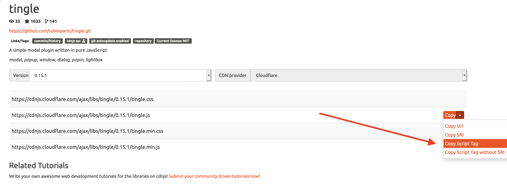

!!! danger ""
    Due:  _**Monday, November 25<sup>th</sup> at 3:05 PM**_

## **Javascript Library Implementation**

### **Overview**

In this lab exercise, you will implement a Javascript library of your choosing.  A Javascript library is a bundled set of Javascript (.js) and CSS (.css) files that can be added to your website to extend its functionality and/or interactivity.   Generally speaking, a library will give you access to a specified set of object methods and properties that you can implement in your HTML according to a syntax that is usually documented on that library's homepage or in its code repository's ReadMe.

You should research Javascript libraries on your own with an eye toward what would be most useful for your final project website, but here are a few favorites to get you started:

* [ScrollReveal](https://scrollrevealjs.org/) - a library for easily animating elements as they enter/leave the viewport.
* [Typed](https://mattboldt.com/demos/typed-js/) - a library that "types" out sentences.
* [Intro.js](https://introjs.com/) - a great library for step-by-step guides on how to interact with and use your website or app.
* [simplePARALLAX](https://simpleparallax.com/) - a library which adds parallax animations on any images.  (See also: [Lax.js](https://alexfox.dev/laxxx/))
* [html5tooltips.js](http://ytiurin.github.io/html5tooltipsjs/) - a library which offers smoothly animated tooltips.
* [p5js](https://p5js.org) - a powerhouse of a library for creating animated and interactive experiences
* [Leaflet](https://leafletjs.com/) - a library for creating interactive maps.
* There are several data viz libraries, such as [Plot.ly](https://plot.ly/javascript/) and [D3.js](https://d3js.org/) and [GoJS](https://gojs.net/latest/index.html)
* [Tone.js](https://tonejs.github.io/) - a library for generating sounds programmatically in the browser (See also the [Web Audio API](https://marcgg.com/blog/2016/11/01/javascript-audio/))
* [simpleLightbox](https://dbrekalo.github.io/simpleLightbox/) - A library for implementing modal image gallery effects.

Note that some Javascript libraries you may encounter are dependent upon [JQuery](https://jquery.com/), a "utility" Javascript library that simplifies the code necessary to do DOM querying and manipulation.   For example, JQuery uses a different syntax to accomplish things that would require more code when written in  "vanilla" javascript:

```javascript
// vanilla Javascript to replace HTML content inside <div id="myDiv></div>
let myDiv = document.getElementById("myDiv");
myDiv.innerHTML = "<p>New paragraph</p>";

// JQuery that accomplishes the same thing
$('#myDiv').html("<p>New paragraph</p>");

```

Cool, huh?  

When a library is "dependent" on JQuery, this means that the library requires that the JQuery library *first* be included in your webpage too, else it won't work.  In other words, you have to include its .js file (or link to a CDN-hosted version) when constructing your site.

JQuery is very powerful and makes writing Javascript a bit more semantically easier to understand and definitely more concise.  But it also increases the size / load time of a website considerably, which may be unnecessary for simple Javascript interactivity.  Furthermore, JQuery can introduce incompatibilities with other libraries written in "vanilla Javascript." 

So, go forth and explore the wide world of Javascript libraries and find one that you'd like to explore for possible integration into your final project website.

### **Requirements for a &#10003;**

Since every Javascript library is different, there's no boilerplate tutorial for setting things up.  The steps below are intended as a general guide only.

1. Create a new folder in your `labs` folder called `lab08` and a new `index.html` file in that folder.

1. Do what is necessary to bring this new page's aesthetic into alignment with your midterm website (link to your midterm.css; add the navigation / footers as necessary, etc.).

1. Assuming you've chosen a Javascript library, read its documentation thoroughly. Look for a "Getting Started" or "Quick Start" guide, if applicable.  Use Google strategically to see if someone has provided a step-by-step tutorial online somewhere.  

1. All Javascript libraries require that you link to the library's .js file (or files).  In some instances, the library also requires one or more CSS files, and, as noted above, other dependencies such as JQuery.  These should all be specified into the library's documentation.   You have two options here:

    1.  Download the files and place them inside the `lab08` folder (or you may wish to store them in your midterm website's `js` and `css` folders).

    ** or **

    1. You can also make use of a [Content Delivery Network (or CDN)](https://www.webopedia.com/TERM/C/CDN.html) and link to those resources using a full path URL.  A popular CDN for Javascript libraries is [https://cdnjs.com/](https://cdnjs.com/).

1.  Remember, all `<link rel="stylesheet">` elements need to be nested inside the `<head>` element.  And in most cases the Javascript files are linked using a `<script>` element located *immediately before* the closing `</body>` tag:

    ```html
    <!-- linking to local javascript -->
    <script src="./path/to/local_javascript.js"></script> 

    <!-- linking to CDNjs javascript -->
    <script src="https://cdnjs.cloudflare.com/ajax/libs/tingle/0.15.1/tingle.js" 
    integrity="sha256-8YVnh8wb00o3YkrAiNrzMNeuq2vPNMXKMtYTEMDRxX0=" 
    crossorigin="anonymous"></script>
    </body>
    ```

    Note the "integrity" attribute in the above example containing a sha256 hash.  This is a security measure that you can read more about here:  [https://developer.mozilla.org/en-US/docs/Web/Security/Subresource_Integrity](https://developer.mozilla.org/en-US/docs/Web/Security/Subresource_Integrity).  The "integrity" value is specific to each CDN and to each file on that CDN.  On CDNjs.com, you can copy the full `<script>` element including its "integrity" atttribute by clicking on the **Copy&#9660;** and selecting "Copy Link Tag" as illustrated below and paste it into your HTML:

    

1. Once you have linked to the library's files, the Javascript methods and CSS styles of the library are available for you to use in your HTML page.  Again, refer to the library's documentation for specifics.  Many modern libraries implement their functionality through the creation of an instance of a Javascript object, setting properties as appropriate.

No opportunity for a &#10003;+ for this lab.  Spend your time continuing to work on your final project website!!!   We hope you're adhering to your stated milestones; get feedback early and often!!