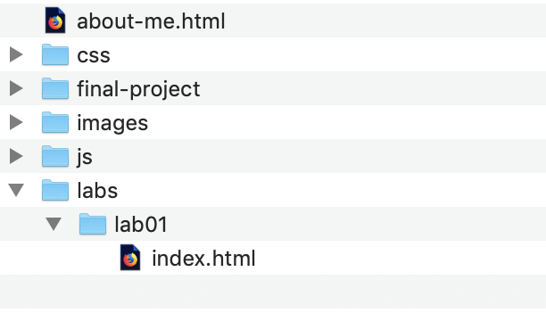

!!! danger ""
    Due:  _**First Lab Section meeting of the week of September 9<sup>th</sup>**_

## **Site Architecture - First Steps**

### Overview

In this second lab assignment, you will accomplish several things:

1. Set up the file/folder structure for your midterm website project, a site that will serve as a platform for submitting all lab homework going forward.

1. Archive your first `about-me.html` webpage so that it is accessible at the following URL (where `netID` is _your_ netiD): [https://people.duke.edu/~netID/labs/01/index.html](https://people.duke.edu/~netID/labs/01/index.html)

1. Develop a new webpage, using HTML5 sectioning tags and what you have learned about CSS layout and the Box Model:
        
    * A landing page that is accessible at the following URL (again, where `netID` is _your_ netiD): [https://people.duke.edu/~netID/](https://people.duke.edu/~netID/)
    

### Part 1: Public_html Folder Structure Setup

1. Find the folder on your local harddrive where you saved your first webpage, `about-me.html`.

1. Within that directory, create folders with these precise names, all lower-case, no spaces:
    
    * `css`
    * `images`
    * `js`
    * `labs`
    * `final-project`

1. Within the `labs` folder, create a sub-folder, named `lab01`.

1. _Move_ your `about-me.html` file into the `lab01` subfolder.

1.  **Rename** the `about-me.html` file as `index.html`

1. The directory structure should look like this:
  

1. Now, "push" this directory structure to your public_html directory using FileZilla:

    1. Launch FileZilla.

    1. Clicking the &#9660; arrow next to the Quickconnect button to access your saved connection settings for accessing via SFTP the server `login.oit.duke.edu` on port 22 with your netID and password.

    1. Make sure you're in the `public_html` folder on the remote server (right-hand pane).  You should see your original `about-me.html` file in the root of that directory.

    1. Find in the left-hand pane the local directory containing the file-folder structure you set up earlier.  

    1.  Click and drag the five new folders from the left pane to the right pane to upload them **into** the `public_html` folder.

1.  If all goes well, when you go to [https://people.duke.edu/~netID/](https://people.duke.edu/~netID/) you should see the directory struture you just created (e.g. five folders - `css`, `final-project`, `images`, `js`, `labs` -- and the original `about-me.html` page.)

1.  Visiting [https://people.duke.edu/~netID/about-me.html](https://people.duke.edu/~netID/about-me.html) should still display your first lab assignment.

1.  Visiting [https://people.duke.edu/~netID/labs/lab01/](https://people.duke.edu/~netID/labs/lab01/) should display the archived version of your `about-me.html` page.

1.  Finally, since you renamed and moved the `about-me.html` page on your local directory, you'll need to download it from the public_html directory so that your local and remote files and folders are in sync. Downloading a file in FileZilla is simple:  Find the file in your remote `public_html` directory (right-hand pane) and drag the file into your local working folder (left-hand pane). 
    
    The structure of your **local** working folder on your harddrive should now look like this:
    

    !!! note
        This is a good time to consider your understanding of the difference and relation between the files stored in the public_html folder of your CIFS share (e.g. the webserver `people.duke.edu`) and the files stored on your local harddrive where you are editing the files.

        These files are not kept in sync by default when using FileZilla, but you want to ensure that they are identical at the start of any significant editing session or else you risk introducing a situation where your site works locally but not on the webserver, or vice versa.  
        
        If you need clarification on this, please discuss with your lab instructors.

### Part 2:  Landing Page

In this second part of the lab assignment, you will create a new design for the "homepage" of your https://people.duke.edu/~netID site.  Here you will make use of HTML5 sectioning tags to define a semantic structure to your HTML and then leverage what you are learning with CSS to create a more advanced design and layout for that page.  Here you should draw on the information presented in the chapters assigned from Duckett (2011) to style text, color, layout and images. 

#### Minimal Requirements

Use the following checklist to make sure you meet the minimum requirements to earn a **&#10003;** for this assignment.  Scroll down to the [Reach Goals](#reach-goals-for-a) section below for suggestions to extend your work to attain a **&#10003;+**.

* [ ] Launch Brackets. 

* [ ] Go to File &rarr; Open Folder and find your local site folder.  Click the `Open` button to select that folder as your working directory.

* [ ] Start a new file (File &rarr; New).

* [ ] Save it as `index.html` in the root of your local site folder on your harddrive.

* [ ] Use the following as your template html:
    
    ```html
    <!DOCTYPE html>
    <html>

    <head>
        <meta charset="UTF-8">
        <title>Title of the document</title>
        <link href="css/main.css" rel="stylesheet">
    </head>

    <body>
        <header>
            <nav>Main menu Goes Here</nav>
        </header>
        <main>
            <section>
                One or more sections here. Be sure to use a new &lt;section&gt; element for each section.
            </section>
            <aside>Sidebar or aside content here</aside>
        </main>
        <footer>Footer content here</footer>
    </body>

    </html>
    ```

    !!! important
        Note that the `<link>` element's `href  ` is a file relative path and that has changed from the original posting of this document.  Root relative paths are not working consistently on `people.duke.edu` and we are trying to ascertain why in consultation with OIT.  Root relative paths seem to work for an `` element's `src` attribute, but not a `<link>` element's `href` attribute. 

* [ ] Using semantically correct HTML, add the following content to the template:

    * [ ] Links in the `<nav>` section:
    
        1. A link (`<a>` element) with text content of `Home` and an `href` attribute that points to `index.html` in the root of your site (e.g. this should point to the very same page that you're editing right now.)

        1. A link (`<a>` element) with text content of `About Me` that points to the `about-me.html` page in the root of your site. 

    * [ ] In the `<section>` section element(s), use headings and paragraphs to explain what this site is, an archive of your work for Fundamentals of Web-Based Communication.  

    * [ ] Use the `<aside>` section element to briefly introduce yourself.  Use a heading element for a title that is appropriate to the context of other headings on your page, and then pen a sentence or two about yourself.  End with a link to your `about-me.html` page.  Example:

        ```html
        <h2>A Little Bit About Me</h2>
        <p>I am a 20th year Duke student who loves apple pie <i>&agrave; la mode</i> and code.<p>
        <p><a href="about-me.html">Read More About Me</a></p>
        ```       

    * [ ] In the `<footer>` section element, create a copyright statement that uses the html entity code for the copyright symbol.

* [ ] Next, you'll use a linked CSS file to style your homepage. You will use this file for styling all of the pages on your midterm site.

    * [ ] Create a new file in Brackets and save it as `main.css` in the `css` folder within your local site directory on your harddrive. 

    * [ ] Since you linked to it in the `<head>` of your HTML file, any changes you make to this CSS file should automatically update when previewing your page in Brackets. 

    * [ ] Test this by adding the following CSS to the `main.css` file and saving it:

        ```css
        * {
            margin: 20px;
            border: 1px solid #ff0000;
        }
        ```

        You should see the margins of your page increase as well as around each element in your page.  All elements should be enclosed in red-bordered box.

    * [ ] Using the proper syntax for comments in CSS, `/* comment goes here */`, comment out that style declaration but leave it at the top of your page to use as needed for further testing. 
    
    * [ ] Use what you've learned about CSS for styling fonts, page layout, text, and images.  Continue researching CSS selectors and the properties that CSS allows you to modify as you shape the look and feel of your site.

* [ ] Finally, SFTP these two files -- `index.html` and `css/main.css` to your `public_html` directory so that your homepage is visible at the root of your `people.duke.edu` URL and your CSS file resides in the `css` folder on the server.

#### Reach Goals

Here are some reach goals to tackle once you have begun to create a site aesthetic that you are happy with:

* Familiarize yourself with [the CSS `float` property](https://internetingishard.com/html-and-css/floats/) and use what you learn change the default HTML flow of your document.  For example, you may wish to convert your `<nav>` section into a vertical menu that is positioned on the left-hand side of the page.   Or float your `<aside>` on the right.

* Familiarize yourself with [the CSS positioning properties](https://www.w3schools.com/css/css_positioning.asp) and use what you learn to make your header or footer stick to the top or bottom of the page.

* Use [CSS link states](https://www.w3schools.com/css/css_link.asp) to transform your navigation links into buttons that dynamically change when a user mouses over or clicks on them.
