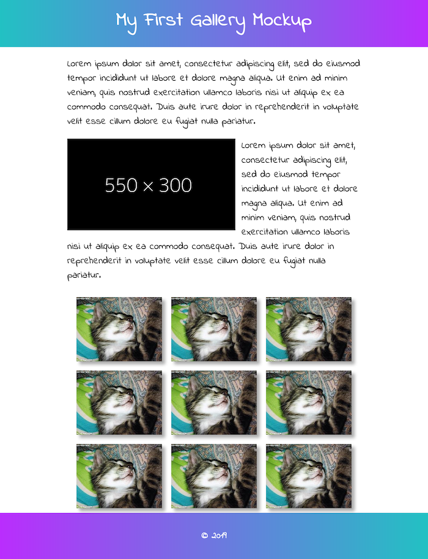

!!! danger ""
    Due:  _**First Lab Section meeting of the week of September 16<sup>th</sup>**_

## **Inline-Block Gallery**

### Overview

In this third lab assignment, you will create a mock-up of a gallery page and explore the use of dummy content generators.  Dummy content generators create fake content to use in your mockups so that you can focus on typography, layout, and color using CSS.

Specifically, the top of your gallery mockup page will display a title &mdash; My First Gallery Mockup &mdash; in a block-level container with a gradient background.  Beneath that, the remainder of your content should be contained with a 960 pixel box that is horizontally centered on the page.  Inside that container, mockup will display two paragraphs of dummy text and will float a large image to the left of the _second_ paragraph, with the text flowing around the right and bottom of the image.  

Below that, a subtitle will announce the "Gallery" section and you will then display nine (9) to fifteen (15) image thumbnails


### Requirements for a &#10003;

Use the following step-by-step to make sure you meet the minimum requirements to earn a **&#10003;** for this assignment.  Scroll down to the [Reach Goals](#reach-goals-for-a) section below for suggestions to extend your work to attain a **&#10003;+**.

1. Launch Brackets. 

1. Go to File &rarr; Open Folder and find your local site folder.  Click the `Open` button to select that folder as your working directory.

1. In the left-hand pane, fine your `labs` folder.  Right-click on it and choose "New Folder" to create a new folder inside your `labs` folder.   Name it `lab03`.

1. Start a new file (File &rarr; New).

1. Save it as `index.html` in the newly created `lab03` folder. 

1. Use the following as your template html:
    
    ```html
    <!DOCTYPE html>
    <html>

    <head>
        <meta charset="UTF-8">
        <title>Gallery Mockup</title>
        <style>
        /* Use the style element in the <head> for this lab assignment */
        </style>
    </head>

    <body>
        <header>
        </header>
        <main>
        </main>
        <footer>
        </footer>
    </body>

    </html>
    ```

1. The `<header>` section:

    * should display as **a block-level element** with no margin between the element and the edge of the browser window but a bottom margin of 20 pixels (e.g. Use this CSS in conjunction with the appropriate type selector: `margin: 0 0 20px 0;`).
    * have a [left-to-right linear gradient background](https://www.w3schools.com/css/css3_gradients.asp)** using colors of your choice expressed as [hexadecimal color codes](https://htmlcolorcodes.com/). 
    * should have 20 pixels of padding on the top and bottom but none on the left and right. 

1. Nested inside the `<header>` element should be a **centered, top-level heading element** with text that reads "My First Gallery Mockup," in a color that of enough contrast to be legible against the gradient background.

1. The `<main>` section element should be set to a maximum width of 960 pixels and centered horizontally on the page using CSS.

1. Nested inside the `<main>` section element should be two sibling `<section>` elements.  The second should have an `id` attribute of "gallery".

1. Inside the the first `<section>` element should be two paragraphs of <q>lorem ipsum</q> placeholder text.  You can use [an online generator]https://loremipsum.io/ultimate-list-of-lorem-ipsum-generators/) or use [this Brackets extension](https://github.com/lkcampbell/brackets-lorem-ipsum) to produce the text for these two paragraphs.

1. [Several online services](https://loremipsum.io/21-of-the-best-placeholder-image-generators/) exist to generate "dummy" images for use in mockups.   In this case, we'll use the [Dynamic Dummy Image Generator](https://dummyimage.com/) to create a placeholder image that we can float to the left of the second paragraph.   

    1. Place this snippet of HTML into the second paragraph:

        ```html
        
        ```

   1. Use the `.float-left` class selector to float the image.  Be sure to add `margin-bottom` and `margin-right` declarations to provide some space between the image and text.


1. Code an image gallery in the second `<section>` element, the one with an `id` attribute of "gallery":

    1. Use an `<h2>` element with the text "Gallery" at the top of this section.

    1. Then create nine (9) to fifteen (15) divs, each with a class of "gallery-item" and containing a dummy image from [LoremFlickr](https://loremflickr.com/):

        ```html
         <div class="gallery-item">
            
         </div>

        ```

    1. Use the `display: inline-block;` CSS property and other styling to display the gallery as a responsive grid of images whose number of rows and columns change dynamically as the browser window is resized.

1. Finally, create a footer for your page using the `<footer>` section element that shares the same left-to-right linear-gradient background, but here you should _reverse_ the colors.

1. Be sure to save your work and then SFTP the folder `lab03` containing the gallery `index.html` file into the `labs` folder of your `public_html` directory on the people.duke.edu webserver.

### Reach Goals

Some reach goals:

* Use a [Google Font](https://fonts.google.com) instead of a standard system font for your textual elements on the page.

* Use the CSS `border` and `box-shadow` properties to add some three-dimensionality to your page and/or the gallery items.

* Use the [CSS `:hover` selector](https://www.w3schools.com/cssref/sel_hover.asp) and the [CSS `filter` property](https://www.w3schools.com/cssref/css3_pr_filter.asp) to either blur or make grayscale each of your gallery images when you hover your mouse over them.

### Example

